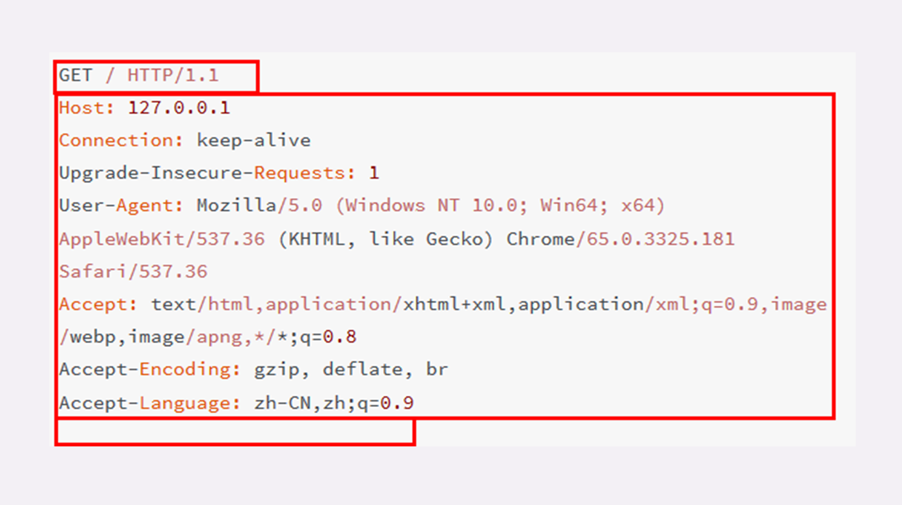

## HTTP 协议概述

> 2019/9/16

#### HTTP 是什么？

超文本、传输、协议：

HTTP 是一个在计算机世界里专门在两点之间传输文字、图片、音频、视频等超文本数据的约定和规范。

HTTP 通常跑在 TCP/IP 协议栈之上，依靠 IP 协议实现寻址和路由、TCP 协议实现可靠数据传输、DNS 协议实现域名查找、SSL/TLS 协议实现安全通信。

#### HTTP 相关

User Agent 翻译过来是用户代理的意思，即 HTTP 协议的请求方。

CDN 内容分发网络，位于浏览器和服务器之间，主要起到缓存加速的作用。

#### 浏览器 HTTP 请求过程

1. 浏览器从地址栏的输入获得服务器的 IP 地址和端口号
2. 浏览器用 TCP 的三次握手与服务器建立连接
3. 浏览器向服务器发送拼好的报文
4. 服务器收到报文后处理请求，同样拼好报文再发送给浏览器
5. 浏览器解析报文，渲染输出页面

#### HTTP 的报文结构

HTTP 请求报文和响应报文结构基本相同，由三部分组成：

1. start line 起始行：描述请求或者响应的基本信息
2. header：使用 key-value 的形式更详细的说明报文
3. body 消息正文：实际传输的数据，它不一定是纯文本，还可以是图片、视频等二进制数据

其中，start line 和 header 经常合成为 ”请求头“ 或者 ”响应头“。

HTTP 协议规定报文必须有 header 但是可以没有 body，而且在 header 之后必须有一个空行，也就是 Windows 系统上的 [CRLF（回车换行）](https://developer.mozilla.org/zh-CN/docs/Glossary/CRLF)。


看一下一个真实的网络请求，三个红色框分别表示 strat line、header、空行，没有 body。



#### 请求行

请求行简要的描述了客户端想要如何操作服务器的资源，由三部分构成：

1. 请求方法：如 GET/POST 表示对资源的操作方式
2. 请求目标：通常是一个 URL，标记了请求方法要操作的资源
3. 版本号：表示使用的 HTTP 协议的版本

这三部分通常有空格间隔，最后用换行表示结束


举一个例子：

```http
GET / HTTP/1.1
```

GET 是请求方法，/ 是请求目标，HTTP/1.1 是版本号

#### 状态行

状态行用来表示服务器的响应状态，同样有三部分构成：

1. 版本号：表示使用的 HTTP 协议的版本
2. 状态码：一个三位数，用来表示服务器的处理结果，比如 200 是成功，500 是服务器错误
3. 原因：是状态码的补充，用来说明更详细的原因


例子：

```http
HTTP/1.1 200 OK
HTTP/1.1 404 Not Found
```

#### Header

请求行或者状态行加上 Header 就构成了 HTTP 报文中完整的请求头或者响应头


请求头和状态头的唯一区别在于起始行；

Header 的 key 和 value 之间用 ：分割，最后使用换行表示结束。

关于 Header 的注意事项：

- key 不区分大小写
- key 里面不允许使用空格和下划线 "_"，但是可以使用连字符 ”-“
- key 后面必须紧跟着 ：不能有空格，：后面的 value 前面可以有空格
- key 的顺序没有意义
- key 原则上不要重复，但是重复问题也不大，不优雅。

#### 常用的 Header

Header 基本可以分为四类：

1. 通用字段：在请求头和响应头里面都可以出现
2. 请求字段：仅出现在请求头里，进一步说明请求信息或者额外的附加条件
3. 响应字段：仅出现在响应头里，补充说明响应报文信息
4. 实体字段：实际上属于通用字段，专门用来描述 body 信息

Host：请求字段，唯一一个在 HTTP/1.1 规范里面要求必须出现的字段，用来告诉服务器请求应该由哪个主机来处理（一个域名可能对应多个主机）

User-Agent：请求字段，用来描述发起 HTTP 请求的客户端

Date：通用字段，通常出现在响应头里，便是 HTTP 报文创建的时间，客户端可以用这个时间搭配其他字段决定缓存策略。

Server：响应字段，通常会告诉客户端正在提供 Web 服务的软件名和版本号，这个字段会把服务器的一部分信息暴露给外界，如果这个版本恰好存在 bug，那么黑客就有可能利用 bug 攻陷服务器。所以，有的网站响应头里要么没有这个字段，要么就给出一个完全无关的描述信息。

Content-Length：实体字段，表示报文 body 的长度，服务器看到这个字段，就知道后续有多少数据可以直接接收，如果没有这个字段，body 就不是定长的。

#### HTTP 协议的特点

HTTP 是灵活可扩展的，可以任意添加头字段实现任意功能；

HTTP 是可靠传输协议，基于 TCP/IP 协议 “尽量” 保证数据的送达；

HTTP 是应用层协议，比 FTP、SSH 等更通用功能更多，能够传输任意数据；

HTTP 使用了请求 - 应答模式，客户端主动发起请求，服务器被动回复请求；

HTTP 本质上是无状态的，每个请求都是互相独立、毫无关联的，协议不要求客户端或服务器记录请求相关的信息。

#### HTTP 协议的缺点

明文传输，数据完全肉眼可见，能够方便的研究分析，但是也容易窃听篡改。

不安全，无法验证通信双方的身份，也不能判断报文是否被篡改。

性能不算差，也不够好，不完全适应现在的互联网，还有很大的提升空间。

