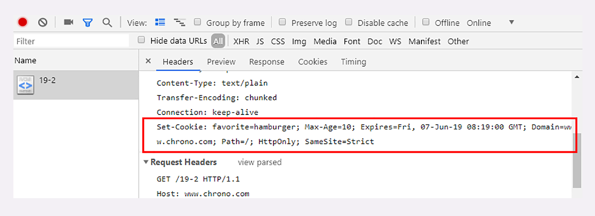

## HTTP 的 Cookie 机制

> 2019/9/26

#### Cookie 的工作过程

当浏览器第一次访问服务器的时候，服务器会给浏览器创建一个身份标识的数据，格式是 **key=value**，然后放进 **Set-Cookie** 字段中，随响应报文一起发送给浏览器。

浏览器收到响应报文后，看到 **Set-Cookie** 字段后，会将值取出，放入 **Cookie** 字段中，随着请求报文发送给服务器。

这样服务器收到请求后，就可以通过 **Cookie** 字段里面的值，识别出用户，提供个性化服务。

**Set-Cookie** 可以有多个，**Cookie** 不需要多个，只要用 **;** 将 Set-Cookie 的值拼接起来就可以了。

Cookie 的大小并不是无限制的，一般总大小不能超过 4K。

#### Cookie 的属性

有效期：

1. Expires：有效期，绝对时间，比如上图中的 Fri，07-Jun-19 08:19:00 GMT

2. Max-Age：有效期，相对时间，单位是秒，把浏览器收到报文的时间加上 Max-Age 计算出绝对时间

   如果这两个都不指定的话，Cookie 仅在浏览器运行时有效，一旦浏览器关闭，Cookie 就会失效，这些被称为会话 Cookie 或者内存 Cookie。

作用域：

Domain 和 Path 指定了 Cookie 所属的域名和路径，浏览器在发送 Cookie 前，会在 URI 中提取 host 和 path，然后对比 Cookie 的属性，如果不相符，则不发送 Cookie。

安全性：

1. HttpOnly：表明此 Cookie 只能通过浏览器的 HTTP 协议传输，禁止其他方式访问。
2. SameSite：用来防范跨站请求伪造攻击，值设置为 Strict 可以严格限定 Cookie 不能随着跳转跨站发送；值设置为 Lax，允许 GET/HEAD 等安全方法，但是禁止 POST 方法跨站发送。
3. Secure：表示这个 Cookie 仅能用 HTTPS 传输，明文的 HTTP 会禁止发送，但是 Cookie 本身是不加密的，浏览器里面还是以明文存在。

#### Cookie 的应用

1. 身份识别：服务器会通过 Cookie 标记你的身份，记录一些相关状态，比如极客时间可以使用 Cookie 记录你那个专栏学到了多少讲。
2. 广告追踪：一些网站的页面里面会嵌入第三方广告商的广告代码，访问这个页面的时候会在这些代码会将 Cookie 存储到浏览器中。这样你切换到其他网站，如果这个网页中也有这个广告商的代码，就能读取之前的 Cookie，知道你的身份，进行精准广告投放。

