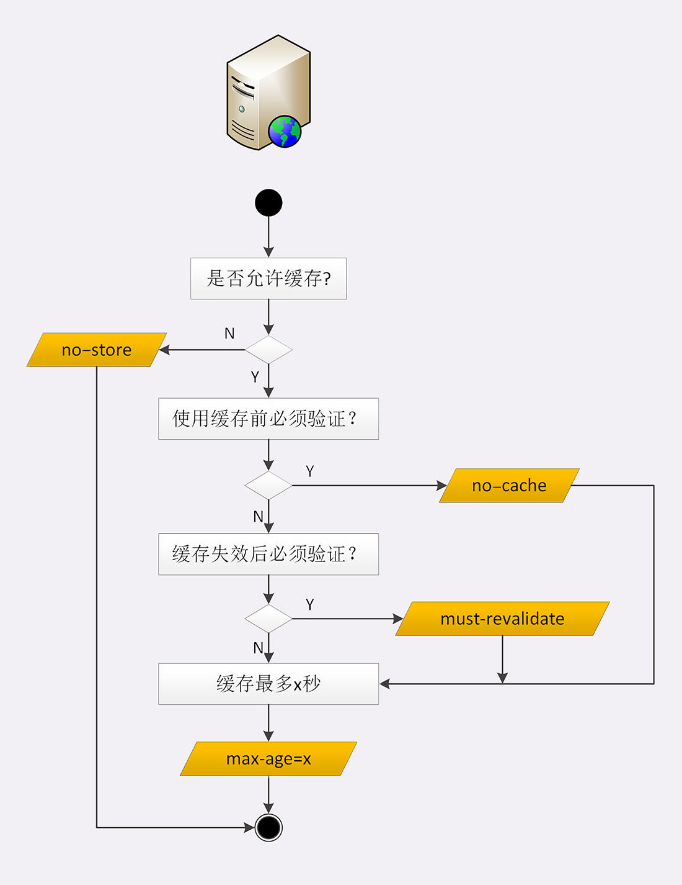

## HTTP 缓存控制

> 2019/9/27

#### 服务器的缓存控制

服务器通过 **Cache-Control** 来控制资源的有效期：

1. max-age=30：自服务器发出响应报文后，数据在客户端的过期时间为 30s，数据过期后将不再使用
2. no-store：不允许缓存，用于某些变化非常频繁的数据，例如秒杀页面
3. no-cache：可以缓存，但是在使用之前必须要和服务器验证是否过期，是否有新的版本
4. must-revalidate：缓存不过期就可以继续使用，过期了还想用必须去服务器验证

通俗解释：

- no-store：买来西瓜不允许放进冰箱，要么立刻吃，要么扔掉
- no-cache：买来的西瓜可以放进冰箱，但是吃之前需要问问超市有没有更新鲜的，如果有，就吃超市的
- must-revalidate：买来的西瓜可以放进冰箱，保鲜期内可以吃，过了保鲜期就要问超市可不可以吃

#### 客户端的缓存控制

客户端同样通过 **Cache-Control** 来控制缓存

1. 在点击刷新按钮的时候，浏览器会在请求头里面加一个**Cache-Control:max-age=0** 表示需要最新的数据，在浏览器中的缓存已经存在了几秒，所以浏览器不会使用缓存，而是向服务器发送请求，获取最新的数据。

2. 在点击前进或者后退按钮的时候，浏览器不会添加 Cache-Control 字段，如果缓存可以用的话，就直接使用缓存。

#### 条件请求

浏览器只能通过 Cache-Control 对缓存进行控制，不能很好的控制缓存，为了更好的控制换粗，浏览器提供了一些条件请求的字段。

1. If-Modified-Since，这个字段用来标识资源的最后修改时间，服务器收到请求后，会把这个时间和服务器资源的时间进行对比，如果客户端的资源不是最新的，服务器会返回 200，并通过 Last-modified 返回最新修改时间，如果服务器的资源没有更新过，会返回 304，表示缓存依然有效，浏览器可以个根据 Cache-Control 来更新一下有效期。
2. If-None-Match，这个和 ETag 来搭配使用，用来标识资源的唯一性，判断要请求的资源与服务器上最新的资源是否一致，一致的话返回 304。

这两个字段都是需要响应的报文预先提供 **Last-modified** 和 **ETag**，在第二次请求的时候，带上这两个值即可。

- Last-modified 表示文件最后修改的时间。
- ETag 是 Entity Tag 的缩写，是资源的唯一标识，ETag 有强弱之分，强 ETag  要求资源在字节级别完全相等，弱 ETag 值的前面有一个 **W/** 的标记，只要求资源在语义上没有变化，但是内部结构可能发生了变化，比如 HTML 标签顺序有调整，或者多了几个空格。

#### ETag 的工作原理

Etag 在服务器上生成后，客户端通过 If-Match 或者说 If-None-Match 这个条件判断请求来验证资源是否修改。

我们常见的是使用If-None-Match，请求一个文件的流程可能如下：

1. 新的请求
2. 客户端发起 HTTP GET 请求一个文件(css ,image, js)；服务器处理请求，返回文件内容和一堆 Header (包括Etag，例如"2e681a-6-5d044840")，http头状态码为为200。

同一个用户第二次这个文件的请求：

1. 客户端在一次发起 HTTP GET 请求一个文件，注意这个时候客户端同时发送一个 If-None-Match 头，这个头中会包括上次这个文件的 Etag (例如"2e681a- 6-5d044840")，这时服务器判断发送过来的 Etag 和自己计算出来的Etag，如果值相等，不返回200，返 回304，客户端继续使用本地缓存。

注意，服务器又设置了Cache-Control:max-age 和 Expires 时，会同时使用，也就是说在完全匹配 If-Modified-Since 和 If-None-Match 即检查完修改时间和 Etag之后 ，服务器才能返回304。

