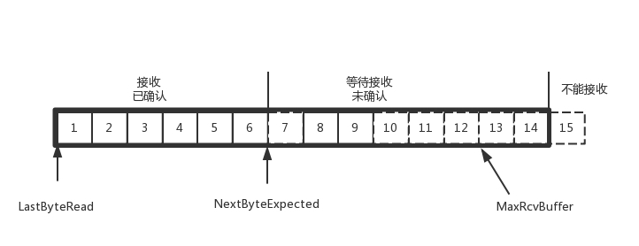

## TCP 的三次握手与四次挥手

> 2019/10/24

TCP 协议的作用是保证数据通信的完整性和可靠性，防止丢包。

#### TCP 协议的特点

1. 基于链接，传输数据之前要先建立好链接，再进行数据传输
2. 链接一旦建立，可以在链接上进行双向通信
3. TCP 的传输基于字节流，将数据按照在字节流中的位置进行编号，接收端通过 ACK 来确认收到数据的编号，以此来保证数据的有序性和完整性，因此 TCP 能够提供可靠性传输。
4. TCP 还能提供流量控制能力，通过滑动窗口来控制数据的发送速率。滑动窗口的本质是动态缓冲区，接收端根据自己的处理能力，动态调整窗口大小，通过 ACK 应答包通知给发送端，发送端根据窗口大小调整发送的的速度。
5. TCP 协议还考虑到了网络问题可能会导致大量重传，进而导致网络情况进一步恶化，因此 TCP 协议还提供拥塞控制。TCP 处理拥塞控制主要用到了慢启动、拥塞避免、拥塞发生、快速恢复四个算法。

#### TCP 的包格式

SYN：发起连接，seq 的值表示当前数据包的第一位在整个数据流中的位置

ACK：确认连接，ack 的值表示期待收到下一个数据包的第一位在整个数据流中的位置

RST：重新连接

FIN：结束连接

#### 三次握手

三次握手的本质是确认双方发送和接收信息的能力。

1. 第一次握手，客户端发送信息，服务器收到后，确认客户端发送信息和服务器接收信息没有问题
2. 第二次握手，服务端发送信息，客户端收到后，确认服务端发送信息和客户端接收信息没有问题，同时确认客户端发送信息和服务区接收信息没有问题
3. 第三次握手，客户端发送信息，服务器收到后，确认服务器发送信息和客户端接受信息没有问题

具体的过程：

1. 客户端主动发送 SYN = 1，主动发起连接，同时发送一个初始序列号 x ，保存在包头的序列号字段中，即 seq = x，之后处于 SYN-SENT 状态。
2. 服务器收到客户端的连接请求，返回一个 ACK 确认客户端的连接，将 ack 确认号设置为 x + 1；同时发送 SYN = 1、seq = y，请求与客户端连接，之后处于 SYN-RCVD 状态。
3. 客户端收到服务器的响应后，返回一个 ACK 确认服务器的响应，同时将 ack 确认号设置为 y + 1，之后处于 ESTABLISHED 状态，因为它一发一收成功了。服务端收到这个 ACK 之后，处于 ESTABLISHED 状态，因为它也一发一收了成功了。

#### 四次挥手

1. 客户端：我要断开了
2. 服务器：稍等，我还有事情没有处理完
3. 服务器：处理完了，可以断开了
4. 客户端：好的，我断开了

在 socket 客户端或者服务端任何一方执行 close 操作，都可以产生挥手操作，具体过程如下：

1. 客户端发送 FIN = 1、seq = x，告诉服务器，想要关闭连接，此时客户端已经没有数据要发送了，但是还可以接受数据，处于 FIN_WAIT_1 的状态。

2. 服务器收到客户端的请求后，发送一个 ACK 包，ack = x + 1，表示已经接受了客户端的关闭请求，但是还没有准备好关闭连接；

   发送完毕后，服务器处于 CLOSE_WAIT 状态，客户端收到这个确认包后，处于 FIN_WAIT_2 状态，等待服务器关闭连接。

3. 服务器向客户端发送一个 FIN = 1、seq = y 的关闭连接请求，发送完成后，服务器处于 LAST_ACK 等客户端最后一个 ACK 确认。

4. 客户端收到服务关闭连接的请求，向服务器发送 ACK、ack = y + 1，确认关闭请求。

   之后，客户端处于 TIME_WAIT 状态，服务器收到这个确认包后，关闭连接，进入 CLOSED 状态。

   客户端等待 2MLS ( Maximum Segment Lifetime，报文最大存活时间 ) 的时间后，没有收到服务器的 ACK，认为服务区已经正常关闭连接，于是自己也关闭连接，进入 CLOSED 转态。
   
   为什么等待的时间是 2MLS 呢，假如 ACK 在在传输过程中丢失，服务器会重新发送 FIN，客户端收到后会重新发送 ACK，假设在 2MLS 的时间内客户端没有收到服务器重发的 FIN，那么客户端就可以认为服务器已经关闭连接。
   
   客户端端回复 ACK 是一个 MLS，服务器重新发送 FIN 也是一个 MLS，所以加起来是 2MLS。

2MLS 有什么用

1. 保证 TCP 协议的全双工连接能够可靠关闭；
2. 保证这次连接的数据段从网络中消失，防止端口被重用时可能产生数据混淆

#### SYN 攻击

SYN 攻击指的是，攻击客户端在短时间伪装大量不存在的 IP 地址，向服务器不断发送 SYN 请求，服务器回复确认包，并等待客户端确认，由于客户端地址是不存在的，服务器需要不断重发直至超时，这些伪造的 SYN 包将长时间占用未连接队列，正常的 SYN 请求被丢弃，导致目标系统运行缓慢，严重者会引起网络堵塞甚至系统瘫痪。

检测 SYN 攻击非常的方便，当你在服务器上看到大量的半连接状态时，特别是源 IP 地址是随机的，基本上可以断定这是一次SYN攻击。

如何应对 SYN 攻击：

1. 设置 tcp_synack_retries = 0，这个参数表示回应第二个握手包（SYN+ACK包）给客户端IP后，如果收不到第三次握手包（ACK包），进行重试的次数（默认为 5）。修改这个参数为 0，可以加快回收半连接，减少资源消耗，但是有一个副作用：网络状况很差时，如果对方没收到第二个握手包，可能连接服务器失败。
2. 调大 tcp_max_syn_backlog，这个参数表示半连接队列长度（默认为1024），加大SYN队列长度可以容纳更多等待连接的网络连接数，具体多少数值受限于内存。

#### TCP 的 Keepalive

TCP 的 Keepalive 是一种长时间没有数据发送的情况下，用来探测连接的对端是否存活的机制。

TCP KeepAlive 的基本原理是，隔一段时间给连接对端发送一个探测包，如果收到对方回应的 ACK，则认为连接还是存活的，在超过一定重试次数之后还是没有收到对方的回应，则丢弃该 TCP 连接。

#### TCP 的滑动窗口

> https://time.geekbang.org/column/article/9141

TCP 在数据传输时通过滑动窗口来进行流量控制，就是如果接受端和发送端对数据包处理的速度不一致，如何让双方达成一致。

TCP 会话的双方都可以同时接收和发送数据，他们都各自维护一个`发送窗口`和一个`接收窗口`。各自的`接收窗口`大小取决于应用、系统、硬件的限制（TCP传输速率不能大于应用的数据处理速率）。各自的`发送窗口`则要求取决于对端通告的`接收窗口`。

发送端的发送缓存内的数据可以分成 4 类：

1. 已发送，收到 ACK
2. 已发送，未收到 ACK
3. 未发送，但是可以发送
4. 未发送，不能发送

其中 2、3 属于发送窗口。

接收方的数据缓存可以分为 3 类：

1. 已经接收
2. 未接收，但是准备接收
3. 未接收，不准备接收

滑动窗口是如何滑动的：

https://www.cnblogs.com/coder-programming/p/10627746.html

这篇文章说的不全，发送窗口并不是固定大小的，会根据接收窗口的大小而调整。

#### 滑动窗口流量控制

在对于包的确认中，同时会携带一个窗口的大小。

我们先假设窗口不变的情况，窗口始终为 9，4 的确认来的时候，会右移一个，这个时候第 13 个包也可以发送了。

这个时候，假设发送端发送过猛，会将第三部分的 10、11、12、13 全部发送完毕，之后就停止发送了，未发送可发送部分为 0。

当对于包 5 的确认到达的时候，在客户端相当于窗口再滑动了一格，这个时候，才可以有更多的包可以发送了，例如第 14 个包才可以发送。

如果接收方实在处理的太慢，导致缓存中没有空间了，可以通过确认信息修改窗口的大小，甚至可以设置为 0，则发送方将暂时停止发送。

我们假设一个极端情况，接收端的应用一直不读取缓存中的数据，当数据包 6 确认后，窗口大小就不能再是 9 了，就要缩小一个变为 8。

这个新的窗口 8 通过 6 的确认消息到达发送端的时候，你会发现窗口没有平行右移，而是仅仅左面的边右移了，窗口的大小从 9 改成了 8。

如果接收端还是一直不处理数据，则随着确认的包越来越多，窗口越来越小，直到为 0。

当这个窗口通过包 14 的确认到达发送端的时候，发送端的窗口也调整为 0，停止发送。

如果这样的话，发送方会定时发送窗口探测数据包，看是否有机会调整窗口的大小。当接收方比较慢的时候，要防止低能窗口综合征，别空出一个字节来就赶快告诉发送方，然后马上又填满了，可以当窗口太小的时候，不更新窗口，直到达到一定大小，或者缓冲区一半为空，才更新窗口。

### Thanks

https://hit-alibaba.github.io/interview/basic/network/TCP.html

https://www.jianshu.com/p/ef892323e68f