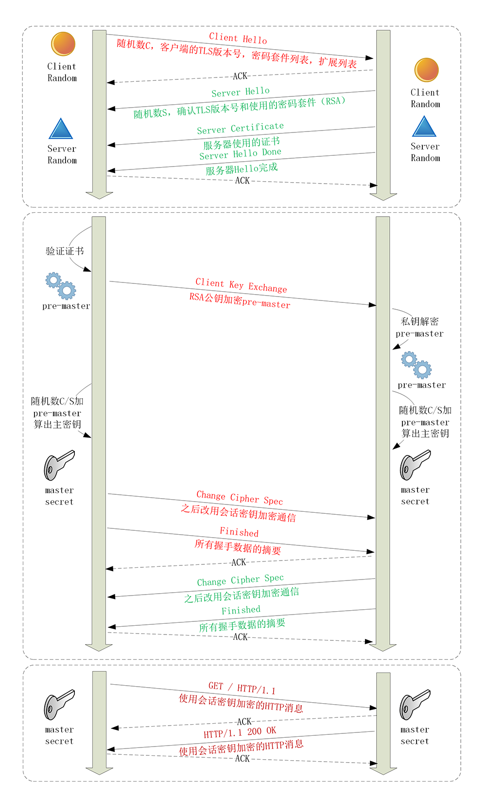

## TLS 1.2 连接过程解析

> 2019/10/11
>
> 看到一篇非常好的文章：https://zhangbuhuai.com/post/tls.html

### HTTPS 如何建立连接

在 HTTP 协议中，通过三次握手建立 TCP 连接后，就可以发送 HTTP 报文了，但是在 HTTPS 中还需要另一个 TLS 的 “握手” 的过程，在 TCP 上建立安全连接，之后才是收发 HTTP 报文。

HTTPS 建立连接的过程就是通非对称加密等一系列密码学算法，协商出一个 “会话秘钥” 作为后面通信过程中对称加密的秘钥。

 #### TLS 协议的组成

TLS 包含几个子协议，分别负责不同的职责，常用的有记录协议、警报协议、握手协议、变更密码规范协议等。

- 记录协议：规定了 TLS 中收到数据的基本单位：记录 ( record )，所有的子协议都需要通过记录协议发出，但是多个记录数据可以在一个 TCP 包中一次性发出。
- 警报协议：负责向对方发出警报信息，类似 HTTP 协议中的状态码，例如：protocol_version 表示不支持旧版本、bad_certificate 就是证书有问题，收到警报后对方可以选择继续，也可以选择终止连接。
- 握手协议：这是 TLS 的核心协议，客户端和服务器在握手的过程中会协商 TLS 的版本号、随机数、密码套件等信息，然后交换证书和密钥，最终双方协商得到会话密钥，用于后续的混合加密。
- 变更密码规范协议：通知对方，后续所有的数据都将使用加密保护，反过来，在它之前，数据都是明文的。

#### ECDHE 握手过程

1. 在 TCP 建立连接之后，浏览器会发一个 “Client Hello” 消息，也就是跟服务器打招呼，里面有客户端的版本号、支持的密码套件、还有一个随机数，用于后续生成会话密钥。

   ```html
   Handshake Protocol: Client Hello
       Version: TLS 1.2 (0x0303)         // TLS 版本
       Random: 1cbf803321fd2623408dfe…   // 随机数
       Cipher Suites (17 suites)         // 密码套件
           Cipher Suite: TLS_ECDHE_RSA_WITH_AES_128_GCM_SHA256 (0xc02f)
           Cipher Suite: TLS_ECDHE_RSA_WITH_AES_256_GCM_SHA384 (0xc030)
   ```

   这个的意思是：我这边有这些信息，你看看哪些是能用的，随机数要留好了。

2. 服务器收到 “Client Hello” 后，会返回一个 “Server Hello” 消息，把版本号对一下，也给出一个随机数，然后从客户端的密码套件列表中选一个作为本次通信用的密码套件。

   ```
   Handshake Protocol: Server Hello
       Version: TLS 1.2 (0x0303)
       Random: 0e6320f21bae50842e96…
       Cipher Suite: TLS_ECDHE_RSA_WITH_AES_256_GCM_SHA384 (0xc030)
   ```

   这些代码的意思是：版本号对上了，可以加密，我选择的密码套件是 TLS_ECDHE_RSA_WITH_AES_256_GCM_SHA384，给你一个随机数，你也留着。

3. 服务器发送 “Server Certificate”，把证书发送给客户端 ( 非对称加密 )

4. 因为服务器选择的是 ECDHE 算法，所以它会在证书后发送 “Server Key Exchange” 消息，里面是椭圆曲线的公钥，用来实现密钥交换算法，再加上自己的私钥签名认证。

   注意，Key Exchange 是使用 ECDHE 算法计算 “Pre-Master”  的参数，公钥只是 Key Exchange 的一个数据

   ```
   Handshake Protocol: Server Key Exchange
       EC Diffie-Hellman Server Params
           Curve Type: named_curve (0x03) // 参数
           Named Curve: x25519 (0x001d)   // 参数
           Pubkey: 3b39deaf00217894e...   // 公钥
           Signature Algorithm: rsa_pkcs1_sha512 (0x0601) // 非对称加密算法
           Signature: 37141adac38ea4...   // 私钥签名
   ```

5. 服务器发送 “Server Hello Done” 消息，表明服务器已经将所有预计的握手消息发送完毕。

6. 客户端验证服务器的证书，确认服务器身份。

7. 客户端按照密码套件的要求，也生成一个椭圆曲线公钥，用 “Client Key Exchange” 消息发送给服务器。

   ```
   Handshake Protocol: Client Key Exchange
       EC Diffie-Hellman Client Params
           Pubkey: 8c674d0e08dc27b5eaa…
   ```

8. 客户端和服务器都拿到了对方的 Key Exchange，然后可以各自使用 ECDHE 计算出一个相同的随机数，“Pre-Master” ( 这个过程是非对称加密的计算 )

9. 现在客户端和服务器手里各自有三个随机数，“Client Random”、“Server Random”、“Pre-Master”，用着三个随机数就可以生成加密会话的主密钥 “Master Secret”，而黑客拿不到 “Pre-Master”，所以也就得不到主密钥。

10. 之后会从主密钥扩展出更多的密码，比如客户端发送用的会话密钥 “client_write_key”，服务端发送用的会话密钥 “server_write_key” 等等，避免只用一个密钥带来的安全隐患。

11. 客户端发送 “Change Cipher Spec”，告诉服务器，客户端已经会话秘钥，并将切换到对称加密模式；然后再发送一个 “Finished”，把之前握手过程中的所有发送的数据做个摘要，再使用刚刚协商好的会话秘钥加密一下，让服务器验证。

12. 服务器也是同样的操作，发送  “Change Cipher Spec” 和 “Finished”。

13. 双方都验证解密解密 OK，握手正式结束，后面收发消息都使用对称加密后的 HTTP 的请求和响应。（注意：客户端可以不用等到服务器发回 “Finished” 立即发出 HTTP 报文，这个叫做 TLS False Start，意思就是抢跑，和 TCP Fast Open 有点像，都是不等连接完全建立就提前发送应用数据，提高传输效率）

#### RAS 握手过程

相比椭圆曲线的握手过程，RSA 的 “Pre-Master” 是客户端产生的随机数，然后使用服务器公钥加密后发送给服务器，其他步骤都是一样的。



### 双向认证

上面的 TLS 握手时一个单向认证，只认证了服务器的身份，而没有认证客户端的身份，这是因为通常单向认证通过后已经建立了安全的通信，可以用账号、密码等手段确认用户的真实身份。

但是有时候在一些安全要求很高的情况下，比如网上银行，会使用 U 盾给用户颁发客户端证书，实现 “双向认证”，这样更加安全。

双向认证的流程没有太多的变化，只是在 “Server Hello Done” 之后，“Client Key Exchange” 之前，客户端要发送一个 “Clent Certificate” 消息，把客户端的证书发送给服务器，服务器收到证书后验证客户端身份。

### 总结

1. HTTPS 协议会先与服务器执行 TCP 握手，之后执行 TLS 握手，才能建立安全的连接。
2. 握手的目的是安全的交换密钥，需要三个随机数，第三个随机数 “Pre-Master” 必须加密传输。
3. “Hello” 消息交换随机数，“Key Exchange” 消息交换 “Pre-Master”。
4. “Change Cipher Spec” 之前传输的都是明文，之后都是对称加密的密文。
5. TLS_ECDHE_RSA_WITH_AES_128_GCM_SHA256：使用 ECDHE 进行密钥交换，生成会话主密钥；使用 RSA 进行身份验证，私钥加密公钥解密；使用 128 为 GCM 分组模式的 AES 进行消息的对称加密；使用 SHA256 摘要算法对数据签名，保证数据的完整性。