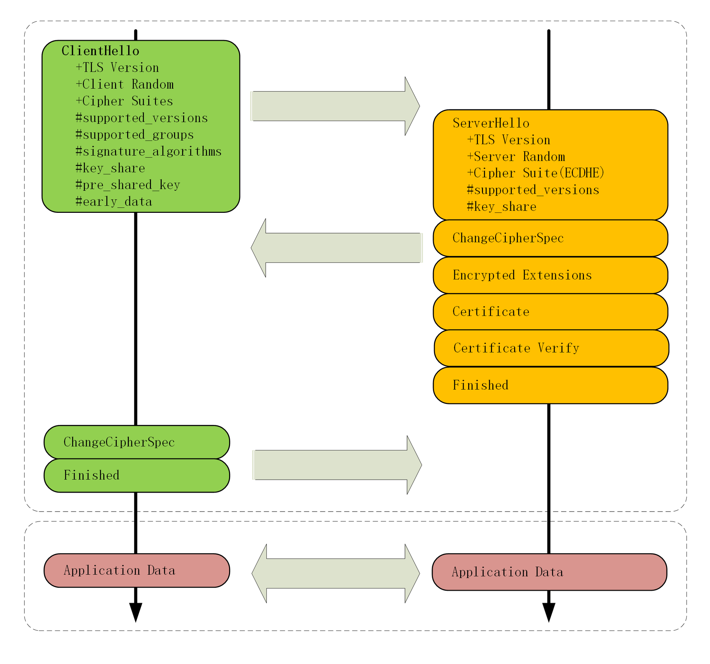

## TLS 1.3 特性解析

> 2019/10/14

TLS 1.3 在 2018 年正式定稿，相比 TLS 1.2，TLS 1.3 主要改进的目标是：兼容性、安全与性能。

#### 兼容性

如何区分 1.2 与 1.3 呢？

使用扩展协议，在记录末尾添加一系列的 “扩展字段” 来增加新的功能，老版本的 TLS 不认识它可以直接忽略，这就实现了向后兼容。

```
Handshake Protocol: Client Hello
    Version: TLS 1.2 (0x0303)
    Extension: supported_versions (len=11)
        Supported Version: TLS 1.3 (0x0304)
        Supported Version: TLS 1.2 (0x0303)
```

在 Version 因为历史兼容性问题无法改变的情况下，添加 supported_versions 来表明支持 TLS 1.3。

#### 强化安全

TLS 1.3 修补了很多不安全的因素，比如：

1. 伪随机数函数由 PRF 升级为 HKDF
2. 明确禁止在记录协议里面是有压缩
3. 废除了 RC4、DES 对称加密算法
4. 废除了 ECB、CBC 等传统分组模式
5. 废除了 MD5、SHA1、SHA-224 摘要算法
6. 废除了 RSA、DH 密钥交换算法和许多命名曲线

经过一番瘦身之后，TLS 1.3 中只保留了 AES、ChaCha20 对称加密算法，分组模式只能用 AEAD 和 GCM、CCM 和 Poly1305，摘要算法只能用 SHA256、SHA384，密钥交换算法只有 ECDHE、DHE，椭圆曲线也被砍到只剩 P-256 和 x25519 等 5 种。

这样下来，TLS 1.3 中之后 5 个密码学套件


为什么废除 RSA 密钥交换算法？

因为它不具备前向安全，假如有这么一个很有耐心的黑客，一直在长期收集混合加密系统收发的报文，如果加密系统用 RSA 做密钥交换，一旦私钥泄露或者被破解，那么黑客就能使用私钥解密出之前所有报文的 “Pre-Master”，再计算出会话密钥，破解所有密文。

这就是所谓的，今日截获，明日破解。

而 ECDHE 算法每次握手时都会生成一对临时的公钥和私钥，每次通信的密钥都是不同的，不会存在还这个问题。

#### 握手分析

1. 在建立 TCP 连接后，浏览器先发送一个 “Client Hello”

   ```
   Handshake Protocol: Client Hello
       Version: TLS 1.2 (0x0303)
       Random: cebeb6c05403654d66c2329…
       Cipher Suites (18 suites) 
           Cipher Suite: TLS_AES_128_GCM_SHA256 (0x1301)
           Cipher Suite: TLS_CHACHA20_POLY1305_SHA256 (0x1303)
           Cipher Suite: TLS_AES_256_GCM_SHA384 (0x1302)
       Extension: supported_versions (len=9)
           Supported Version: TLS 1.3 (0x0304)
           Supported Version: TLS 1.2 (0x0303)
       Extension: supported_groups (len=14)
           Supported Groups (6 groups)
               Supported Group: x25519 (0x001d)
               Supported Group: secp256r1 (0x0017)
       Extension: key_share (len=107)
           Key Share extension
               Client Key Share Length: 105
               Key Share Entry: Group: x25519
               Key Share Entry: Group: secp256r1
   ```

   Cipher Suites：表示密码套件

   supported_versions：表示这是 TLS 1.3

   supported_groups：表示支持的曲线

   key_share：表示曲线参数

2. 服务器回复 “Server Hello” 

   ```
   Handshake Protocol: Server Hello
       Version: TLS 1.2 (0x0303)
       Random: 12d2bce6568b063d3dee2…
       Cipher Suite: TLS_AES_128_GCM_SHA256 (0x1301)
       Extension: supported_versions (len=2)
           Supported Version: TLS 1.3 (0x0304)
       Extension: key_share (len=36)
           Key Share extension
               Key Share Entry: Group: x25519, Key Exchange length: 32
   ```

   supported_versions 确定使用的是 TLS 1.3，key_share 里面带上曲线和对应的公钥参数。

3. 现在客户端和服务器都拿到了四个信息：Client Random、Server Random、Client Params、Server Params，这样两边就可以各自使用 ECDHE 计算出 “Pre-Master”，再计算出主密钥 “Master Secret”，效率比 TLS 1.2 提高了一大截。

4. 在算出主密钥后，服务器发送 “Change Cipher Spec”，比 TLS 1.2 更快进入加密通信，之后发送的证书什么的都是加密的了。

5. 之后服务器会发送一个 “Certificate Verify” 信息，用服务器的私钥把前面的曲线、套件、参数等握手数据加了签名，强化了身份认证。

6. 服务器发送 Finished 信息，把之前握手过程中的所有发送的数据做个摘要，再加密一下，让客户端验证。

7. 客户端也是同样的操作，发送 “Change Cipher Spec” 和 “Finished”。

8. 双方都验证解密解密 OK，握手正式结束，后面收发消息都使用对称加密后的 HTTP 的请求和响应。




#### 问题

1. 如果 TLS1.3 中没有指定密钥交换算法和签名算法，那么在握手的时候会不会有问题呢？

   不会有问题，TLS1.3 精简了加密算法，通过 supported_groups、key_share、signature_algorithms 等参数确定密钥交换算法和签名算法，不用在 Cipher Suites 里面协商了。

2. 解析一下为什么 RSA 不具有前向安全

   RSA 在握手时，会使用服务器的公钥加密 “Pre-Master” 发送给服务器，一旦服务器的私钥泄露，那么之前的信息都会被破译，虽然每次 TLS 握手的会话密钥都不一样，但是服务器的私钥始终不会变。

3. TLS1.3 的握手过程和 TLS1.2 的 False Start 有什么异同？

   相同点，都是在未收到 Finished 确认消息就已经向对方发送加密消息了，不同点 TLS1.3 将 Change Cipher Spec 合并到了 Hello 中。