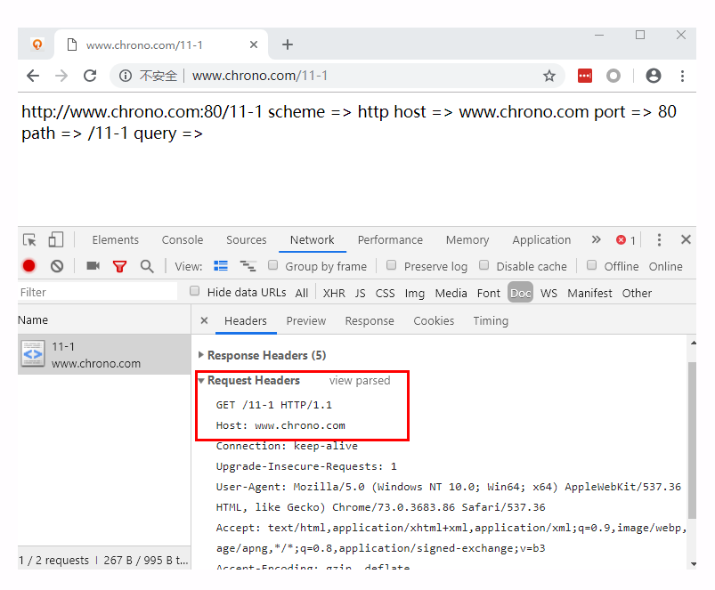

## URI 是什么

> 2019/9/20

URI 是统一资源标志符；URL 是统一资源定位符，也就是我们的网址，URI 的子集。

#### URI 的格式

URI 本质是一个字符串，它的作用是 **唯一的标记资源的位置或者名字**，有四部分组成，通常是：

- scheme：协议，表示访问这个资源应该使用哪种协议，scheme 有一个固定 **://**。
- authority：主机名，通常用 host:port 表示，表示资源所在的主机，host 可以是域名或者 IP 地址，必须要有，port 可以省略，浏览器会根据 scheme 使用默认的 port，例如 HTTP 协议的默认端口是 80，HTTPS 协议的默认端口是 443。
- path：路径，用来标记资源的位置，采用类似文件目录的表示方式，这部分以 **/** 开始，如果省略的话，默认一个 **/** 代表根目录。
- query：用 **？**开始，有一个或者多个 **key=value** 字符串组成，这些 KV 值用 **&** 连接，表示对资源附加的额外要求。

#### URI 的完整形态

这个比上面多出了两部分：

- user:password@：身份信息，表示登录主机的用户名和密码，现在已经不推荐这种形式了，因为它把敏感信息以明文形式暴露出来，存在安全隐患。

- \#fragment：片段标识符，URI 所定位的资源内部的一个标签，浏览器可以获取资源后直接跳转到它指示的位置。

  但是 \#fragment 仅能由浏览器这样的客户端使用，浏览器不会将它发送给服务器，服务器也不会使用这种方法去处理资源。

#### URI 编码

为什么需要 URI 编码

- URI 里面只能使用 ASCII 码，没办法使用中文等其他语言
- 某些特殊的 URI ，可能会出现 **？@&** 等符号，导致 URI 解析错误

如何编码：

- 将特殊字符转换为十六进制字节码，然后前面加上一个 **%**
- 中文等其他语言使用 UTF-8 编码后在转义成十六进制字节码，前面加上一个 **%**

#### Query 参数和 Header 有什么不同呢

query 参数是针对资源的操作，header 是针对本次请求，也就是报文。

#### 请求的 Url 是如何转换为请求头的

http://www.chrono.com/11-1

如下图：

- 协议：请求行中的 HTTP/1.1 
- 主机名：header 中的 Host 
- path 和 query：请求行中 GET 后面

