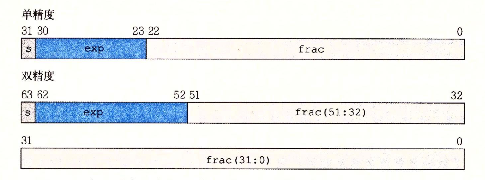
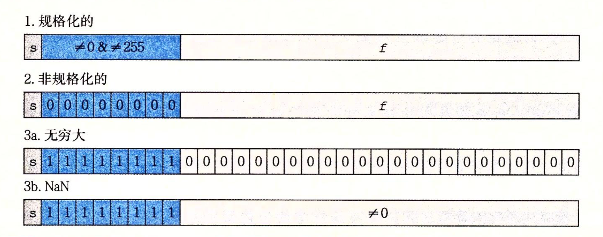

## Float 中的最大最小值，NaN 和 Infinity

> 2019/5/17

| 数据类型 | 字节 Byte | 二进制位 bit | 最大值      | 最小值     |
| -------- | --------- | ------------ | ----------- | ---------- |
| byte     | 1         | 8            | 2的7次方-1  | -2的7次方  |
| short    | 2         | 16           | 2的15次方-1 | -2的15次方 |
| int      | 4         | 32           | 2的31次方-1 | -2的31次方 |
| long     | 8         | 64           | 2的63次方-1 | -2的63次方 |
| float    | 4         | 32           |             |            |
| double   | 8         | 64           |             |            |

### Float 最大最小值

在 Float.java 的源码中

```java
public static final float MAX_VALUE = 0x1.fffffeP+127f; // 3.4028235e+38f
public static final float MIN_VALUE = 0x0.000002P-126f; // 1.4e-45f
```

这两个值是怎么来的呢？

### IEEE 浮点表示

> 小数的负数不是补码存储

在 IEEE 标准中，用下面的形式来表示一个浮点数：
$$
V = ( -1 )^s * M * 2^e
$$

- 符号：s 决定这个数的正负，0 正 1 负
- 尾数：M 是一个二进制小数，范围在 [1,2) 或者 [0,1)
- 阶码：e 的作用是对浮点数加权，这个权重是 2 的 e 次幂，e 可能为负数

浮点数在计算机中存储时，分为三个部分：



以单精度为例：

- s：1位，存储符号位，0 正 1 负
- exp：8位，存储阶码
- frac：23位，用来表示尾码 M，但是 M 的值也取决于阶码是否为 0

根据 exp 的值，被编码的值可以分为三种不同的情况：



### 情况 1 规格化的值（Float 最大最小值）

此时 e 不为 0 或者 255，是以偏置 ( biased ) 形式表示的有符号整数，阶码的值 E = e - Bias，其中 e 是无符号数，Bias 的值为：
$$
2 ^ { k-1} - 1
$$
这个值 单精度是 127，双精度是 1023，其中 k 表示阶码的位数。

所以，在 Float 中 E 的取值范围是 [1, 254] - 127 = [-126, 127] 

小数部分 frac 被解释为描述小数值 f，其中 0 <= f < 1，其二进制表示为：
$$
0.f_{n-1}…f_1f_0
$$
也就是二进制小数点最高有效位在左边，尾数 M 定义为 M = 1 + f​，这种方式也叫做 *隐含的以 1 开头的表示*。

因为我们可以把 M 的二进制表达式看做：
$$
1.f_{n-1}…f_1f_0
$$
小数的二进制与十进制之间的转换见[这篇文章](https://mp.weixin.qq.com/s/34Fg9GSqRDoBbGFPzOt_ow)的最后。

我们总能够调整阶码 E 使是尾数 M 的范围在 
$$
1<=M<2
$$
这种表示方法是一种轻松获得一个额外精度的技巧，既然 M 的第一位总是 1，那么我们就不需要显示的表示它。

现在我们再来看看 Float 的最大最小值就非常好解释了：

```java
// 0x 表示 16 进制
// 1.fffffe 表示尾数 M
// fffffe 转换为二进制是 23 个 1 和 1 个 0，因为 frac 只有 23 位且有效位从左边算起，刚好 23 位都是 1
// P+127f 表示的值为 2的127次幂，在 Float 中阶码 E 的最大是 127
public static final float MAX_VALUE = 0x1.fffffeP+127f; // 3.4028235e+38f
public static final float MIN_VALUE = 0x0.000002P-126f; // 1.4e-45f
```

### 情况 2 非规格化的值（0值）

当阶码域全为 0 时，表示的是非规格化的值。在这种情况下，阶码值 E = 1 - 127 = -126，尾数 M = f，不包含隐式开头的 1。

非规格化数有两个用途：

- 提供了一种表示数值 0 的办法，在规格数中，M 总是 >= 1，因此我们不能表示 0
- 表示那些非常接近 0 的数，它们提供了一种属性，叫做逐渐溢出，其中可能的数值分布均匀的接近 0

在表示 0 时，我们根据 IEEE 的浮点标准，可以得到 +0.0 和 -0.0 两个值，它们在某些方面被认为是不同的，而在其他方面相同。

```java
float positiveZero = Float.intBitsToFloat(0b0_00000000_0000_0000_0000_0000_0000_000);
float negativeZero = Float.intBitsToFloat(0b1_00000000_0000_0000_0000_0000_0000_000);
System.out.println(positiveZero);  // 0.0
System.out.println(negativeZero);  // -0.0
System.out.println(positiveZero == negativeZero);  // true
```

### 情况 3 特殊值 (NaN 和 Infinity)

这类值在阶码全部为 1 的时候出现：

- 当小数域全为 0 时，得到的值是无穷 ( Infinity )
  - s 为 0，+Infinity
  - s 为 1，- Infinity
- 当小数域为非零时，得到的值被称为 NaN ( Not a Number )，一些运算的结果不能是实数或者无穷就会返回 NaN，比如：根号下 -1

```java
float positiveInfinity = Float.intBitsToFloat(0b0_11111111_0000_0000_0000_0000_0000_000);
float negativeInfinity = Float.intBitsToFloat(0b1_11111111_0000_0000_0000_0000_0000_000);
System.out.println(positiveInfinity); 	// Infinity
System.out.println( negativeInfinity);  // -Infinity
System.out.println(positiveInfinity == Float.POSITIVE_INFINITY);  // true
```

### 关于 NaN 和 Infinity 的运算

- 无限乘以 0 等于 NaN
- 无限除以无限等于 NaN
- 其他与无限运算的结果都是无限
- 和 NaN 的任何运算都是 NaN
- NaN 不等于任何值，包括它自己

判断一个数是否是 Infinity

```java
public static boolean isInfinite(float v) {
    return (v == POSITIVE_INFINITY) || (v == NEGATIVE_INFINITY);
}
```

判断一个数是否是 NaN

```java
public static boolean isNaN(float v) {
    return (v != v);
}
```

### 浮点数的精度丢失问题

```java
System.out.println(0.1 + 0.2 == 0.3); // flase
double result = 1.0 - 0.9;
System.out.println(result); // 0.09999999999999998
```

在计算机中，浮点数是以 IEEE 标准以二进制存储在计算机中的，就像十进制没有办法精确表示 1/3 一样，二进制也没有办法精确表示 0.1，Float 和 Double 主要是为了科学计算和工程计算而设计的，它们执行的是二进制浮点计算，所以计算结果并不是完全精确的。

因此，Float 和 Double 不适用与精确计算，如：货币计算，如果需要精确计算，可以使用 BigDecimal。

同样，因为浮点数是不精确的，也不能直接使用 == 或者 != 来比较大小，我们通常使用 <= 来代替

```java
if(Math.abs(x - y) <= EPSINON) { // EPSINON 允许的误差，即精度
    // 认为 x == y
}
```

### Thanks

《深入理解计算机系统》第三版第二章

https://mp.weixin.qq.com/s/34Fg9GSqRDoBbGFPzOt_ow

https://blog.csdn.net/tomcat_2014/article/details/51453988

https://www.jianshu.com/p/d07538c980ad

https://blog.csdn.net/mydriverc2/article/details/49888947