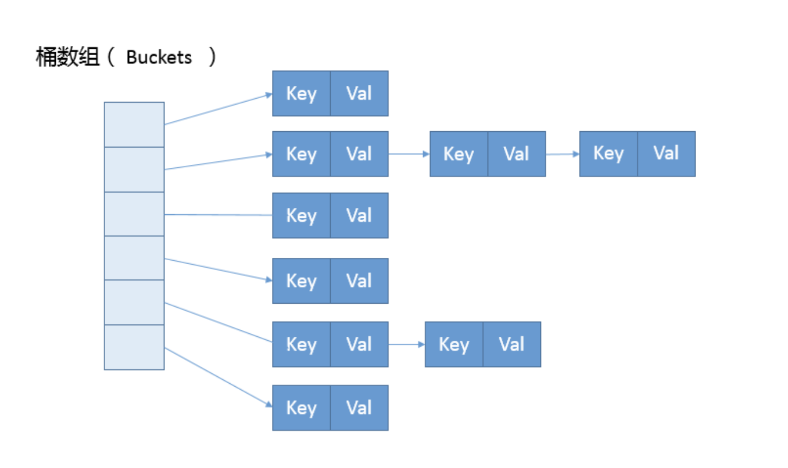

## HashMap 源码解析

> 2019/5/15

### 概述

Hashtable、HashMap、TreeMap 都是一些常见的 Map 实现，是以键值对形式存储和操作数据的容器类型。

Hashtable 底层是哈希表数据结构，不可以存入 null 键 null 值，本身是线程同步的，由于同步导致的性能开销，已经不推荐使用。

HashMap  底层也是哈希表数据结构，支持 null 键和 null 值，它是非线程同步的，**是绝大部分利用键值对存取场景的首选**。

TreeMap 是基于红黑树提供的一种有序的 Map，和 HashMap 不同，它的 get、put、remove之类操作都是 O（log(n)）的时间复杂度，具体的顺序由 Comparator 或者键的自然顺序（实现 Comparable 接口）决定。

### HashMap 源码分析

#### 基本属性

在 HashMap 的构造方法中，有三个变量需要了解：

- capacity：HashMap 的容量，必须为 2 的整数次幂，默认 16，这个容量指的是数组的大小。
- loadFactor：负载因子，默认 0.75，负载因子的主要作用是用来确定阈值。
- threshold：扩容阈值，如果频繁的发生哈希冲突，那么  HashMap性能就会直线下降，为了提高性能，不会等到满了才扩容，而是当 HashMap 的 size 大于 threshold 时，会触发 resize 对 HashMap 进行扩容。

#### 数据结构



HashMap 可以看做有数组和链表组成的复合结构，通过哈希值决定键值对所在的数组，如果哈希值相同，将以链表形式存储，如果链表的大小大于阈值 ( TREEIFY_THRESHOLD，8 ) 时，链表将会被改造为树形结构。

#### Node<K , V>

在 HashMap 中键值对的存储正是通过 Node 来实现的，Node 实现了 Map.Entry<K , V> 接口，包含了 hash、key、value 、next 等数据。

next 也是一个 Node，这个是标准的链表结构，**HashMap 的数据结构正是通过 Node<K,V>[] table 来实现的**。

#### 基本原理

HashMap 实现键值对存储的基本原理：将 key 转换为 hash 值，然后将 hash 值转换为  Node<K,V>[] 下标 position，然后将对于的 Node 直接放入该下标，这样每次根据 hash 值就能直接知道放在什么位置，或者反过来，根据 hash 值就能直接知道从哪个位置取值。

问题：

- hash 很大，数组容量不够

  position =  (n - 1) & hash，转换后的 position 的大小不会超过数组长度 n

- 不同的 hash 值转换后对应同一个 position 怎么办

  这种现象被称为哈希冲突，将其放在已有 Node 的 next 上，组成链表

- 如何查询

  没有哈希冲突的时候，根据 positon 直接取值，如果出现了哈希冲突，遍历链表，通过 key 值来查询

#### (n - 1) & hash <= n 的原理

n 作为 HashMap 容量，需要满足一个条件：n 必须是 2 的整数次幂。

那么 n - 1 的二进制为：…1111 这种形式，一共 32 位，不够前面补 0，我们知道：

- 0 & 任何数 = 0
- 1 & 任何数 = 任何数

hash &  …1111 实际上**相当于给 hash 保留低位**，最大值就是 …1111 本身。

举个例子

```java
int n = 31;
int hash = Objects.hash("hash");
System.out.println("n = " + Integer.toBinaryString(n));       // 11111
System.out.println("hash = " + Integer.toBinaryString(hash)); // 1100001100000100101101
// n & hash 相当于给 hash 保留低位，结果是 01101，十进制为 13
System.out.println("n & hash= " + (n & hash)); // 13
```

#### 为什么 HashMap 的容量必须是 2 的整数次幂？

1. 确保 hash 转换后的 position 的大小不会超过数组长度 n

2. 减少哈希冲突。

   如果二进制某位是 0，那么在做 & 运算的时候，无论做运算的另一方在该位是 0 还是 1，得到的结果都是 0；那么则此位置上的数据不同的 hash 值对应计算出来的 position  却相同，这样会增加产生哈希冲突的概率。

   而 2 的整数次幂减去 1 的二进制是 …111，这样没有 0 位可以避免这种情况的发生。

#### hash 值的计算

可以看到，在 put 和 get 的时候，都使用了 HashMap 内部的一个 hash 方法计算 key 的哈希值。

```java
static final int hash(Object key) {
    int h;
    return (key == null) ? 0 : (h = key.hashCode()) ^ (h >>> 16);
}
```

我们先看这个操作，对 key.hashCode() 右移 16 位，然后异或它本身

```java
int hash = 683243;
System.out.println(Integer.toBinaryString(hash));
System.out.println(Integer.toBinaryString(hash >>> 16));
System.out.println(Integer.toBinaryString(hash ^ (hash >>> 16)));

// 10100110110011101011  源数据
// 00000000000000001010  相当于保留高位
// 10100110110011100001  异或操作
```

这个操作明显想保留 hash 的高位的不同，因为在 (n - 1) & hash 寻址的会舍弃 hash 的高位，那么如果一些数据仅仅在高位上有不同，在进行 (n - 1) & hash 运算后就非常容易出现哈希冲突，这个内部 hash 的作用就是减少这种数据的哈希冲突。

#### put 方法

将键值对存储进 HashMap，如果键已经存在，新值将代替旧值，并返回旧值。

```java
/**
 * @param hash hash for key
 * @param key the key
 * @param value the value to put
 * @param onlyIfAbsent if true, don't change existing value
 * @param evict if false, the table is in creation mode.
 * @return previous value, or null if none
 */
final V putVal(int hash, K key, V value, boolean onlyIfAbsent,
               boolean evict) {
    
    Node<K,V>[] tab; // 数组链表 table
    Node<K,V> p;     // 通过哈希算法计算出的数组的索引对应的 Node
    int n; // table 的长度
    int i; // p 的下标
    // 1. table 为空，调用 resize 方法初始化 table
    if ((tab = table) == null || (n = tab.length) == 0)
        n = (tab = resize()).length;
    // 2. 不存在哈希冲突，将 Node 直接保存到 table 中，数组下标为 (n - 1) & hash
    if ((p = tab[i = (n - 1) & hash]) == null)
        tab[i] = newNode(hash, key, value, null);
    // 3. 出现了哈希冲突
    else {
        Node<K,V> e; // 负责存储新数据的, 下面的操作就是寻找这个 Node, 然后把数据存起来
        K k;
        // 3.1 key 已经存在是不是相等
        if (p.hash == hash &&
            ((k = p.key) == key || (key != null && key.equals(k))))
            e = p;
        // 3.2 链表已经树化，调用 putTreeVal 将 Node 放入树中
        else if (p instanceof TreeNode)
            e = ((TreeNode<K,V>)p).putTreeVal(this, tab, hash, key, value);
        // 3.3 处理哈希冲突
        else {
            for (int binCount = 0; ; ++binCount) {
                // 3.3.1 当前 Node 的 next 不为空，将新 Node 保存到 p 的 next
                e = p.next;
                if (e == null) {
                    p.next = newNode(hash, key, value, null);
                    // 3.3.2 当前链表长度大于等于 TREEIFY_THRESHOLD，将链表树化
                    if (binCount >= TREEIFY_THRESHOLD - 1) // -1 for 1st
                        treeifyBin(tab, hash);
                    break;
                }
                // 3.3.3 key 在链表中存在，链表再次冲突
                if (e.hash == hash &&
                    ((k = e.key) == key || (key != null && key.equals(k))))
                    break;
                p = e;
            }
        }
        // 3.4 找到了 e 
        if (e != null) { // existing mapping for key
            // 3.4.1 记录下旧值
            V oldValue = e.value;
            if (!onlyIfAbsent || oldValue == null)
                // 3.4.2 插入新值
                e.value = value;
            afterNodeAccess(e);
            // 3.4.3 返回旧值
            return oldValue;
        }
    }
    // 4. 记录哈希表被修改的次数
    // 这个字段主要的作用是检测在进行迭代是 HashMap 中的数据是否发生变化
    // 如果发生变化，抛出 ConcurrentModificationException
    ++modCount;
    // 5. 插入成功，size 加一，如果 size > threshold，调用 resize 方法扩容
    if (++size > threshold)
        resize();
    afterNodeInsertion(evict);
    // 6. key 不存在返回 null
    return null;
}
```

#### put 总结

1. 哈希表为空，调用 resize 初始化
2. 将 key 的哈希值转换为数组下标：position = ( n -1 ) & hash
3. 当前数组索引位置为空，不存在哈希冲突，将 value 直接存入数组中
4. 当前数组索引位置已经有值，存在冲突，通过 hashCode && equals 判断 key 值是不是相等
5. 如果相等，使用新值替换旧值，并返回旧值
6. 不相等，将 Node 存储在数组索引 Node 的 next 位置，如果 next 为空，直接创建 Node 并存储
7. 如果 next 不为空，再次出现哈希冲突，同样适用 key 的 hashCode && equals 判断 key 值是不是相等，之后一直遍历链表，找到可以存储该值的 Node。
8. 遍历过程中发现链表长度大于等于 8，并且数组长度大于等于 64 时，将链表改造成树
9. 找到 Node 后，使用新值替换旧值，并返回旧值
10. 记录哈希表被修改的次数
11. 判断 HashMap 的 size 是否大于阈值，大于的话调用 resize 扩容

注意：

1. 出现哈希冲突的本质原因是，通过 hash 值计算得到数组的索引位置后，发现这个地方已经有值了。

2. 在处理哈希冲突的时候，比较的是 hashCode && equals，这也就是为什么 Object 做为 key 为什么要重写 hashCode 和 equals 方法。

   如果两个对象的 hashCode 不同，equals 肯定不同，如果两个对象的 hashCode 相同，equals 不一定相同 (  产生了哈希冲突 ) 。hashCode 是放入 HashMap 的必要条件，hashCode 相同时，会出现哈希冲突，equals 就是为了解决哈希冲突。

#### get 方法

get 方法相对简单，就是下面几步

- 根据 hash 值从数组中取出元素
- 判断 hash 值和 key 是否与目标 hash 值和 key 均相等，相等直接返回元素
- 不相等的话，判断链表是否已经树化，已经树化调用 getTreeNode 取出元素
- 没有树化，遍历链表，通过比较 hash 值和 key 来取出元素

```java
final Node<K,V> getNode(int hash, Object key) {
    
    Node<K,V>[] tab; 
    Node<K,V> first, e; 
    int n; 
    K k;
    // 哈希表不为 null，并且根据 hash 值在数组中取出的元素不为空
    if ((tab = table) != null && (n = tab.length) > 0 &&
        (first = tab[(n - 1) & hash]) != null) {
        // 判断取出的元素的 hash 值和 key 和目标的 hash 值和 key 是否相等
        if (first.hash == hash && // always check first node
            ((k = first.key) == key || (key != null && key.equals(k))))
            return first;
        // 不相等
        if ((e = first.next) != null) {
            // 链表已经树化
            if (first instanceof TreeNode)
                // 调用 getTreeNode 取值
                return ((TreeNode<K,V>)first).getTreeNode(hash, key);
            do {
                // 遍历链表取值
                if (e.hash == hash &&
                    ((k = e.key) == key || (key != null && key.equals(k))))
                    return e;
            } while ((e = e.next) != null);
        }
    }
    return null;
}
```

#### resize 方法

resize 方法有两个作用，Initializes or doubles table size。

- 初始化哈希表
- 对哈希表进行扩容

```java
final Node<K,V>[] resize() {
    Node<K,V>[] oldTab = table;
    int oldCap = (oldTab == null) ? 0 : oldTab.length; // 默认为 0
    int oldThr = threshold;
    int newCap, newThr = 0; // 默认为 0
    // 1. 容量大于 0
    if (oldCap > 0) {
        // 1.1 容量达到最大值，阈值设置为 Int 最大值，哈希表已经扩容到最大容量
        if (oldCap >= MAXIMUM_CAPACITY) {
            threshold = Integer.MAX_VALUE;
            return oldTab;
        }
        // 1.2 一般情况下的扩容，容量和阈值都扩大 2 倍
        else if ((newCap = oldCap << 1) < MAXIMUM_CAPACITY &&
                 oldCap >= DEFAULT_INITIAL_CAPACITY)
            newThr = oldThr << 1; // double threshold
    }
    // 2. 阈值大于 0
    else if (oldThr > 0) // initial capacity was placed in threshold
        newCap = oldThr;
    // 3. 初始化哈希表的容量和阈值，容量默认 16，负载系数默认 0.75，阈值默认 12
    else {               // zero initial threshold signifies using defaults
        newCap = DEFAULT_INITIAL_CAPACITY;
        newThr = (int)(DEFAULT_LOAD_FACTOR * DEFAULT_INITIAL_CAPACITY);
    }
    // 4. 新的阈值为 0，赋值为 newCap * loadFactor
    if (newThr == 0) {
        float ft = (float)newCap * loadFactor;
        newThr = (newCap < MAXIMUM_CAPACITY && ft < (float)MAXIMUM_CAPACITY ?
                  (int)ft : Integer.MAX_VALUE);
    }
    // 5. 根据 newCap 创建一个新的哈希表，将老哈希表中的数据放到新的哈希哈希表中
    threshold = newThr;
    @SuppressWarnings({"rawtypes","unchecked"})
    Node<K,V>[] newTab = (Node<K,V>[])new Node[newCap];
    table = newTab;
   	// 省略 ...
    return newTab;
}
```

#### resize 总结

##### 根据我上面的注释，resize 方法可以分为三部分

- 1，扩容，将哈希表的容量和阈值扩大 2 倍
- 2、3、4，初始化哈希表阈值和容量
- 5，真正的创建哈希表操作，扩容的时候还要将老的值放置到新的数组，这个操作是 HashMap 性能开销的主要来源，所以我们应该尽量避免扩容。

##### 流程梳理

- 创建 HashMap 时未指定任何参数。第一次进入 resize 直接走到 **3**，使用默认值初始化 HashMap，之后大部分情况走 **1.2** 将容量和阈值扩大 2 倍。
- 创建 HashMap 指定了容量。此时在构造函数会通过 tableSizeFor 计算出阈值，阈值大于等于容量，且是 2 的整数次幂，此时第一次进入 resize 会走 **2**，重新将阈值赋值给容量，接着走 **4**，计算新的阈值，之后大部分情况走 **1.2** 将容量和阈值扩大 2 倍。
- 进入 1，但是不满足 1.2 的条件，这个时候回进入 4，重新计算阈值。

##### HashMap 数组的最大长度是多少？

Integer.MAX_VALUE - 1

我们知道 HashMap 中定义的 MAXIMUM_CAPACITY = 1 << 30，但是有一种极端情况，就是在进入 1.2 的时候：

```java
(newCap = oldCap << 1) < MAXIMUM_CAPACITY
```

此时 oldCap 的最大值为 MAXIMUM_CAPACITY - 1，newCap 的值为 **( MAXIMUM_CAPACITY - 1 ) * 2**，这个值也就是 Integer.MAX_VALUE - 1。

可以看到在 resize 后面的代码中，并没有对 newCap 重新赋值的代码了。

##### 阈值的计算有三种方法：

HashMap 的构造方法中的 tableSizeFor，阈值大于等于容量，且是 2 的整数次幂，但是 tableSizeFor 仅仅在初始化的时候执行一次，阈值的计算大部分是下面两种情况：

- resize 初始化的时候：阈值 = 容量 * 负载因子

- resize 正常扩容的时候：扩大 2 倍。

#### HashMap 性能优化

1、在创建 HashMap 的时候指定合理的容量，尽量避免扩容

我们知道，**阈值 = 容量 * 负载因子**，而元素数量大于阈值的时候，会引起扩容

也就是，**元素数量 > 容量 * 负载因子**，会引起扩容。

那么，我们在设置初始容量的时候们应该：

**容量 * 负载因子 > 元素数量，同时是 2 的整数次幂**

2、调整负载因子

我们知道在 resize 方法中初始的阈值  = 容量 * 负载因子，关于负载因子这一点：

- 如果负载因子过大，会导致不能及时的扩容，从而显著增加哈希冲突
- 如果负载因子过小，会导致频繁扩容，也会影响 HashMap 的性能

所以，我们应该根据实际情况，在有数据支撑的情况下去调整负载因子，如果不确定，直接使用默认值 0.75。

#### 其他

- HashMap 不是线程安全的，如果有并发问题，推荐使用 ConcurrentHashMap。

- 在创建迭代器后，如果发现 HashMap 发生变化，则抛出 ConcurrentModificationException 异常，这个异常主要是通过 modCount 来记录和检测的。

### Thanks

https://jayfeng.com/2016/12/28/%E7%90%86%E8%A7%A3HashMap/