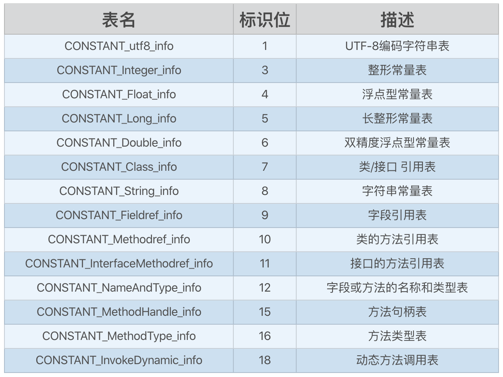

## JVM：Class 文件结构

#### Class 文件的意义

Class 文件解除了 Java 虚拟机和 Java 语言的耦合关系。

Java 虚拟机不仅仅可以运行 Java 语言，只要是能编译 class 字节码的语言，都可以用 Java 虚拟机来运行。

#### Class 文件结构

从大的方向来说，class 文件可以分出无符号数和表两种结构：

- 无符号数：以 u1、u2、u4、u8 来分别代表 1 个字节、2 个字节、4 个字节和 8 个字节的无符号数
- 表：表有多个无符号数或者其他表构成的符合数据结构，class 文件中的表都是由 “_info” 结尾

class 文件结构如下：


当 JVM 加载 class 文件的时候，就是根据上图去解析 class 文件，加载 class 文件到内存中，并在内存中分配相应的空间。


我们的代码如下：

```java
public class User {

    public static final String ID = "12345";

    private String name;

    User(String name) {
        this.name = name;
    }

    public String getAge() {
        return name;
    }

    public void setAge(String age) {
        this.name = name;
    }
}
```

用 16 进制编辑器打开一个 Class 文件如下：

```java
cafe babe 0000 0034 0019 0a 0004 0013 09
// cafe babe 魔数
// 0000 次版本号 
// 0034 主版本号
// 0019 常量池大小
// 0a 第一个常量, CONSTANT_Methodref_info
// 0004 表示这个方法属于哪个类, 十进制 4, 指向常量池第 4 个常量
// 0013 表示这个方法的名称和类型, 十进制 19, 指向常量池第 19 个常量
0003 0014 0700 1507 0016 0100 0249 4401
0012 4c6a 6176 612f 6c61 6e67 2f53 7472
696e 673b 0100 0d43 6f6e 7374 616e 7456
616c 7565 0800 1701 0004 6e61 6d65 0100
063c 696e 6974 3e01 0015 284c 6a61 7661
2f6c 616e 672f 5374 7269 6e67 3b29 5601
0004 436f 6465 0100 0f4c 696e 654e 756d
6265 7254 6162 6c65 0100 0667 6574 4167
6501 0014 2829 4c6a 6176 612f 6c61 6e67
2f53 7472 696e 673b 0100 0673 6574 4167
6501 000a 536f 7572 6365 4669 6c65 0100
0955 7365 722e 6a61 7661 0c00 0a00 180c
0009 0006 0100 0455 7365 7201 0010 6a61
7661 2f6c 616e 672f 4f62 6a65 6374 0100
0531 3233 3435 0100 0328 2956 0021 0003
0004 0000 0002 0019 0005 0006 0001 0007
0000 0002 0008 0002 0009 0006 0000 0003
0000 000a 000b 0001 000c 0000 002a 0002
0002 0000 000a 2ab7 0001 2a2b b500 02b1
0000 0001 000d 0000 000e 0003 0000 0007
0004 0008 0009 0009 0001 000e 000f 0001
000c 0000 001d 0001 0001 0000 0005 2ab4
0002 b000 0000 0100 0d00 0000 0600 0100
0000 0c00 0100 1000 0b00 0100 0c00 0000
2500 0200 0200 0000 092a 2ab4 0002 b500
02b1 0000 0001 000d 0000 000a 0002 0000
0010 0008 0011 0001 0011 0000 0002 0012
```

其中 cafe babe 表示魔数，魔数是 class 文件的表示，固定为 cafe babe，如果开头不是 cafe babe，说明这不是一个 class 文件，不能被 JVM 加载。

魔数后面是 class 文件的版本号，0000 0034，前两个字节 0000 表示次版本号，0034 表示主版本号。

版本号后面是常量池表，常量池中保存了类的各种信息，例如：类名称、父类名称、类的方法名、参数名、参数类型等等。

常量池中的每个数据都以表的形式存储，这些表共分为 14 中：



每一个都有一个 u1 大小的 tag 值，这个值用来标识当前的数据结构属于哪个表。

例如 tag = 7 的 CONSTANT_Class_info 表结构如下：

```java
table CONSTANT_Class_info {
    u1  tag = 7;    // 标识这个表是 CONSTANT_Class_info
    u2  name_index; // 指针, 指向常量池中索引为 2 的常量
}
```

CONSTANT_Utf8_info 表的结构如下：

```java
table CONSTANT_utf8_info {
    u1  tag = 1;   // 标识这个表是 CONSTANT_Utf8_info
    u2  length;    // 用来表示 bytes 的长度
    u1[] bytes;
}
```

String 类型就是以 CONSTANT_Utf8_info 形式存储的，以为 u2 是一个两字节的无符号整数，最大为 65536，同时 byte 数组会预留两个字节来存储 null，因此一个字符串最大的长度 65534 字节。

> U2 是一种伪数据结构，最大值为 65536，但是在「深入理解 Java 虚拟机」中说 U2 的最大值为 65535

之后用两个字节 0019 来表示常量池的大小，0014 对应十进制为 25，也就是说常量计数器的值为 20，其中下表为 0 的常量被 JVM 留作其他特殊用途，也就是说这个常量池中有 24 个常量。

> 0 项常量用来表示：不引用常量池中任何一个常量的意思

之后我们看第一个常量 0a，十进制 10，表示这是一个 CONSTANT_Methodref_info

```java
CONSTANT_Methodref_info {
  u1 tag=10;
  u2 class_index; 			// 指向此方法的所属类
  u2 name_type_index;   // 指向此方法的名称和类型
}
```

也就是说再 0a 后面的两个字节指向这个方法属于哪个类，0004 十进制为 4，指向常量池第 4 个常量

接着的两个字节表示该方法的名称和类型，0019，十进制 19, 指向常量池第 19 个常量

至此第一个常量解析完成，第二个常量也是一样的。

用 `javap -v User.class` 看一下字节码文件，我们可以看到 Constant pool 第一个常量为 Methodref，之后 4 是一个 Class 指向了 Object，19 是 NameAndType，方法名和类型，指向了 \<init> 和 ()V，\<init> 表示构造方法，()V 中的表示无参、无返回值。

常量池之后还有各种各样的类信息，就不一一说了，它们有很多都会指向常量池中。

```java
Classfile /Users/ssyijiu/my/OnLeetCode/src/User.class
  Last modified 2020-4-18; size 448 bytes
  MD5 checksum 919d8181b9933475279d5227639a7bd8
  Compiled from "User.java"
public class User
  minor version: 0
  major version: 52
  flags: ACC_PUBLIC, ACC_SUPER
Constant pool:
   #1 = Methodref          #4.#19         // java/lang/Object."<init>":()V
   #2 = Fieldref           #3.#20         // User.name:Ljava/lang/String;
   #3 = Class              #21            // User
   #4 = Class              #22            // java/lang/Object
   #5 = Utf8               ID
   #6 = Utf8               Ljava/lang/String;
   #7 = Utf8               ConstantValue
   #8 = String             #23            // 12345
   #9 = Utf8               name
  #10 = Utf8               <init>
  #11 = Utf8               (Ljava/lang/String;)V
  #12 = Utf8               Code
  #13 = Utf8               LineNumberTable
  #14 = Utf8               getAge
  #15 = Utf8               ()Ljava/lang/String;
  #16 = Utf8               setAge
  #17 = Utf8               SourceFile
  #18 = Utf8               User.java
  #19 = NameAndType        #10:#24        // "<init>":()V
  #20 = NameAndType        #9:#6          // name:Ljava/lang/String;
  #21 = Utf8               User
  #22 = Utf8               java/lang/Object
  #23 = Utf8               12345
  #24 = Utf8               ()V
{
  public static final java.lang.String ID;
    descriptor: Ljava/lang/String;
    flags: ACC_PUBLIC, ACC_STATIC, ACC_FINAL
    ConstantValue: String 12345

  User(java.lang.String);
    descriptor: (Ljava/lang/String;)V
    flags:
    Code:
      stack=2, locals=2, args_size=2
         0: aload_0
         1: invokespecial #1                  // Method java/lang/Object."<init>":()V
         4: aload_0
         5: aload_1
         6: putfield      #2                  // Field name:Ljava/lang/String;
         9: return
      LineNumberTable:
        line 7: 0
        line 8: 4
        line 9: 9

  public java.lang.String getAge();
    descriptor: ()Ljava/lang/String;
    flags: ACC_PUBLIC
    Code:
      stack=1, locals=1, args_size=1
         0: aload_0
         1: getfield      #2                  // Field name:Ljava/lang/String;
         4: areturn
      LineNumberTable:
        line 12: 0

  public void setAge(java.lang.String);
    descriptor: (Ljava/lang/String;)V
    flags: ACC_PUBLIC
    Code:
      stack=2, locals=2, args_size=2
         0: aload_0
         1: aload_0
         2: getfield      #2                  // Field name:Ljava/lang/String;
         5: putfield      #2                  // Field name:Ljava/lang/String;
         8: return
      LineNumberTable:
        line 16: 0
        line 17: 8
}
SourceFile: "User.java"
```

