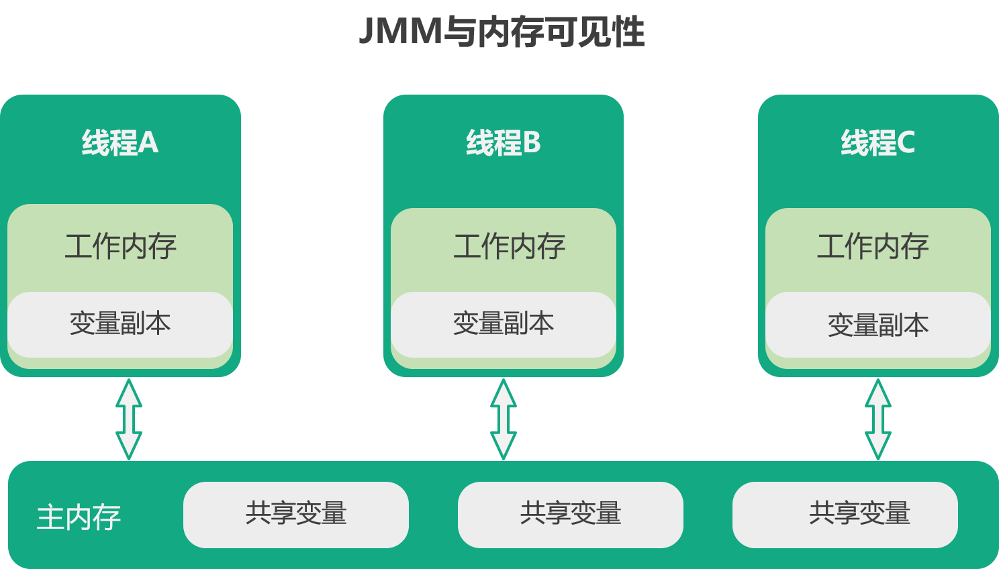
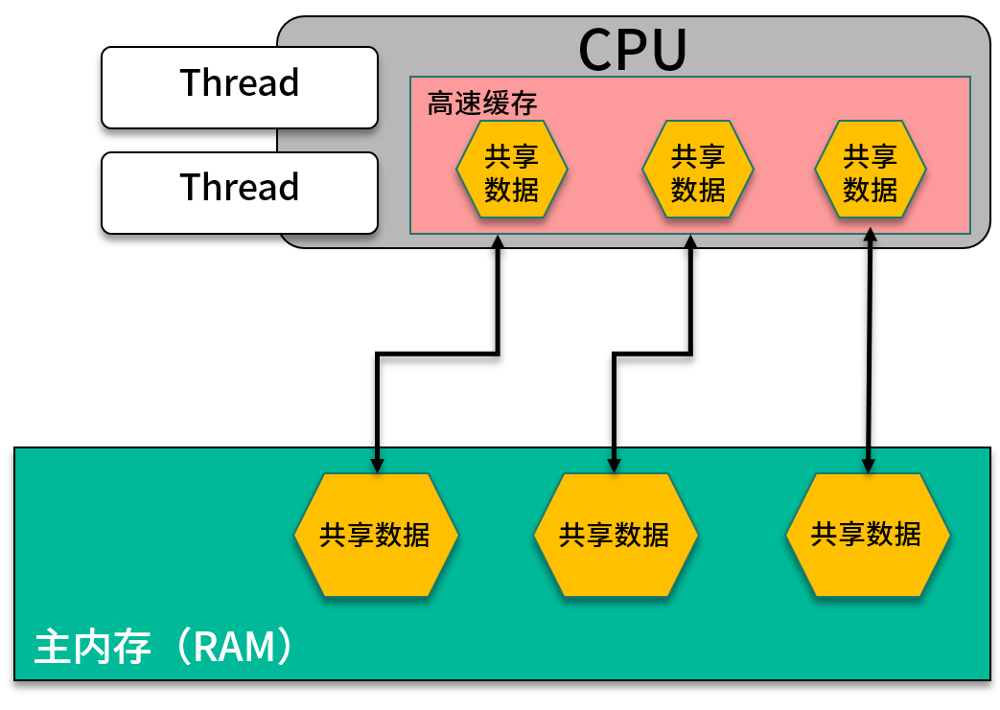

## JVM：JMM 与内存可见性

#### 概述

在 JMM 中所有的共享变量都存储在主内存，每个线程都有自己的工作内存，工作内存中会保留主内存变量的副本，线程对变量的读写必须在自己的工作内存中进行，不能直接读写主内存中的变量。

事实上，在 Java 中并不存在所谓的工作内存，它对 CPU 寄存器和高速缓存的抽象描述。

#### 缓存一致性问题

在同一时刻，多个线程被不同的 CPU 同时执行，这个时候可能会出现一个共享变量在不同 CPU 中的高速缓存中不一致的情况。

#### 指定重排序

CPU 和一些编译器（比如 JIT）为了提供运算效率，在不影响运算结果的情况下，可能会对输入的字节码指令进行重新排序。

由于缓存一致性问题和指令重排序的存在，可能会让我们的运算结果在多线程环境下出现问题。

为了解决这个问题，Java 虚拟机提出了一套规范，Java 内存模型。

#### JMM

Java 内存模型简称 JMM ( java memory model ），在 JMM 中统一使用工作内存来当作 CPU 寄存器或者告诉缓存的抽象，所有的共享变量都存储在主内存，每个线程都有自己的工作内存，工作内存中会保留主内存变量的副本，线程对变量的读写必须在自己的工作内存中进行，不能直接读写主内存中的变量。

JMM 提供了原子性、可见性、有序性三种保证。

#### 原子性

JMM 保证对 long 和 double 外的基本数据类型的读写都是原子性的，synchronized 也会提供原子性保证。

#### 可见性

JMM 通过 synchronized 和 volatile 提供可见性的保证，volatile 在变量赋值后会强制刷新到主存，在读取变量时，会强制从主存重现加载，保证不同的线程总是能看到该变量的最新值。

关于 volatile 见：https://add7.cc/java/java-zhong-de-volatile-guan-jian-zi

#### 有序性

JMM 的有序性通过 volatile 和一些列 happens-before 原则来保证，volatile 通过禁止指令重排序来保证变量读写的有序性。

happens-before 原则如下：

- Program order rule：逻辑靠前的字节码的执行结果，一定对后续逻辑的字节码可见
- Monitor lock rule：一个锁如果处于被锁定状态，那么必须先执行 unlock 操作后才能进行 lock 操作
- Volatile variable rule：前一个对 volatile 的写操作一定后一个 volatile 的读操作之前
- Thread start rule：一个线程内的任何操作必需在这个线程的 start() 调用之后
- Thread termination rule：一个线程的所有操作都会在线程终止之前
- Interruption rule：interrupt() 的调用在中断检查之前发生
- Finalizer rule：一个对象的初始化完成发生在它的 finalize() 方法调用之前
- Transitivity：可传递性

