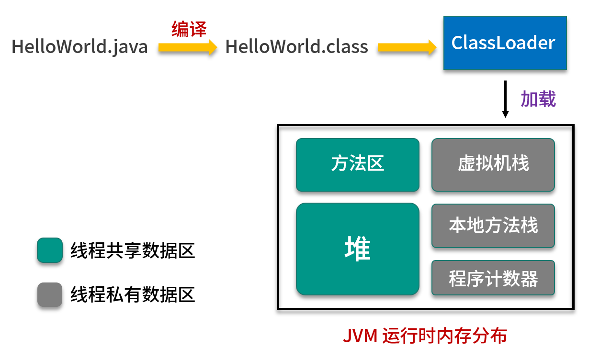
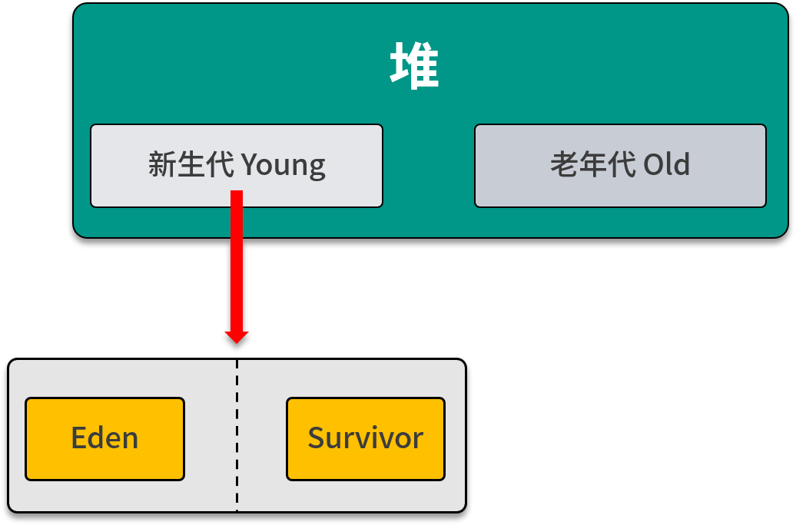

## JVM：内存模型

> 2019/11/14

#### 概述



HelloWorld.java 文件被加载到内存中的过程：

1. 编译器将 HelloWorld.java 编译生成 HelloWorld.class 文件

2. Java 访问 HelloWorld 这个类时，会使用 ClassLoader 将 HelloWorld.class 加载到 JVM 内存

3. JVM 内存分为 程序计数器、虚拟机栈、本地方法栈、堆、方法区 五个部分，其中堆和方法区是所有线程共享，其他区域为线程私有。

   拉勾教育版权所有：https://kaiwu.lagou.com/course/courseInfo.htm?courseId=67

####程序计数器

程序计数器主要用于记录当前线程执行的位置 ( 虚拟机字节码指令的地址 )。

Java 程序多线程的，CPU 可以在多个线程中分配时间片，但是在任何一个时间点只有一个线程在执行，当一个线程被 CPU 挂起后，需要记录代码的执行位置，这样 CPU 才能重新执行这个线程，知道从哪个指令开始执行，而程序计数器就是用来存储这个指令的地址。

注意：

1. 在 Java 虚拟机规范中，对程序计数器这一区域没有规定任何 OutOfMemoryError 情况。
2. 程序计数器是线程私有的，每条线程内部都有一个独立程序计数器。它的生命周期随着线程的创建而创建，随着线程的结束而死亡。
3. 当一个线程正在执行一个 Java 方法的时候，这个计数器记录的是正在执行的虚拟机字节码指令的地址。如果正在执行的是 Native 方法，这个计数器值则为空（Undefined）。


#### 虚拟机栈

每个线程在创建的时候都会创建一个虚拟机栈，线程在执行方法的时候会同时创建一个栈帧，用来存储局部变量表、操作栈、动态链接、方法出口等信息。调用方法时执行入栈，方法返回时执行出栈。

在这个区域会出现两种异常：

- StackOverflowError：当线程请求栈深度超出虚拟机栈所允许的深度时抛出。
- OutOfMemoryError：当 Java 虚拟机无法申请足够内存时抛出。

##### 局部变量表

局部变量表用来存储方法的参数，和方法内部创建的局部变量。

参数和局部变量会依次传递到局部变量表从 0 开始的地方，如果调用的方法是实例方法，当前实例的应用会存储在局部变量表 0 索引的地方。

在 Java 文件编译从 class 文件时，会在 Code 属性表中 max_locals 确定局部变量表的容量。

```java
public static int add(int k) {
	int i = 1;
	int j = 2;
	return i + j + k;
}
```

javap -v 查看字节码指令：

```java
public static int add(int);
    descriptor: (I)I
    flags: ACC_PUBLIC, ACC_STATIC
    Code:
      stack=2, locals=3, args_size=1
         0: iconst_1   // 将常量 1 入栈
         1: istore_1   // 将栈顶元素出栈并放入局部变量表索引为 1 的位置
         2: iconst_2   // 将常量 2 入栈
         3: istore_2   // 将栈顶元素出栈并放入局部变量表索引为 2 的位置
         4: iload_1    // 将局部变量表索引为 1 的值入栈
         5: iload_2    // 将局部变量表索引为 2 的值入栈
         6: iadd       // 取出栈顶的两个元素, 进行加法运算, 然后重新入栈
         7: iload_0    // 将局部变量表索引为 0 的值入栈（应该是参数 k 保存在了局部变量表索引 1 的位置）
         8: iadd       // 取出栈顶的两个元素, 进行加法运算, 然后重新入栈
         9: ireturn    // 结束
```

其中 locals 就是表示局部变量表的长度是 3，保存了参数 k 和局部变量 i、j

从上面的字节码指令可以看出，局部变量表和操作数栈一起配合完成了运算。

指令说明：

- iconst 和 bipush：将常量入栈，区别是常量取值为 -1~5 使用 iconst 指令，-128~127 使用 bipish 指令。
- istore_x：将栈顶元素放入局部变量变的索引 x 的位置
- iload_x：将局部变量表中的 x 索引位置的值入栈
- iadd：将栈顶的两个元素出栈，做加法运算，然后重新入栈

##### 操作数栈

在方法执行过程中，操作数栈是用来存储运算数据的位置，各种字节码指令会从操作数栈中取出数据，然后进行运算，之后将操作结果重新入栈。

比如上面的 iadd 就是将操作栈中栈顶的两个元素弹出，执行加法运算，然后重新入栈。

和局部变量表一样，操作栈的最大深度会在编译的时候写入在 Code 属性表中的 max_stack 数据项中。

##### 动态链接

> 动态链接到底是个什么？有什么作用？

Class 文件中除了有类的版本、字段、方法、接口等描述信息外，还有一个常量池，用来存放编译期间生成各种字面量和符号引用，这部分内容会在类加载完成后放入方法区的常量池存放，符号引用包括下面三类：

- 类和接口的全限定名
- 字段的名称和描述符
- 方法的名称和描述符

在方法调用的时候，需要将常量池中指向方法的符号引用转换为直接引用，这个转换一部分会在类加载的时候或者第一次调用的时候转换完成，这部分成为静态链接。

还有一部分需要在运行时期才能确定如何转换，比如重载方法调用、so 动态库的调用等，这部分成为动态链接。

每个栈帧都持有一个指向该方法在方法区中的引用，这个引用就是为了支持动态链接。

##### 返回地址

- 正常退出：方法正常执行完成，或者遇到一个返回指令并退出，没有抛出异常。
- 异常退出：方法执行过程中遇到异常，并且异常在这个方法中没有得到处理，导致方法退出。

无论方法是采用哪种方式退出的，在方法退出后都要返回方法被调用的位置，程序才能正确执行。

返回地址就是恢复上层方法的执行状态的，一般来说，方法正常退出是，调用者的 PC 计数值可以用来作为返回地址，而异常退出时，返回地址是有异常处理表确定的。

#### 本地方法栈

本地方法栈与栈类似，也是用来保存线程执行方法时的信息，不同的是，执行 Java 方法使用栈，而执行 native 方法使用本地方法栈。

#### 堆

堆是 JVM 中最大的一块内存，它被所有线程共享，它的主要作用是用来存放 Java 对象实例，因此堆也是 GC 管理的主要区域，当堆中没有可用空间时，会抛出 OOM 异常。

根据对象存活的周期不同，堆中的内存可以划分为新生代、老年代，其中新生代又可以分为 Eden 区和 Survivor 区。



图中不同的区域存储着不同生命周期的对象，这样可以根据不同的区域使用不同的垃圾回收算法，从而更有针对性，提高垃圾回收的效率。

#### 方法区

方法区主要存储被已经被 JVM 加载的类信息（版本、字段、方法、接口）、常量、静态变量、以及编译后的代码等数据，方法去和堆一样，也是被线程共享的区域。

方法去和永久区的区别：

- 方法去是 JVM 规范中规定的一块区域，规定了这一区域要存放哪些数据。
- HotSpot 在 JDK1.7 以前使用 "永久区"（或者叫Perm区）来实现方法区，在 JDK1.8 之后 "永久区" 就已经被移除了，取而代之的是一个叫作 "元空间（metaspace）" 的实现方式.
