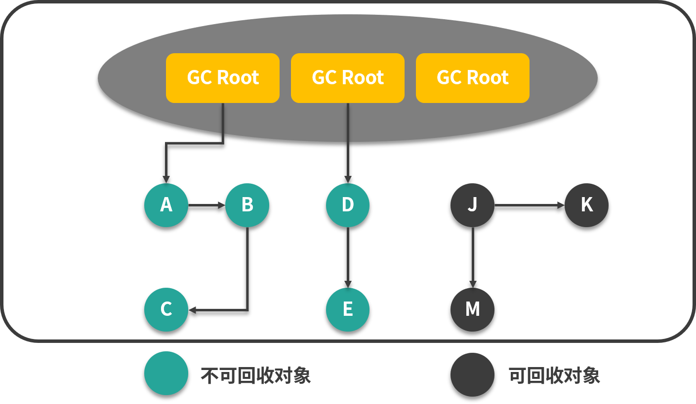
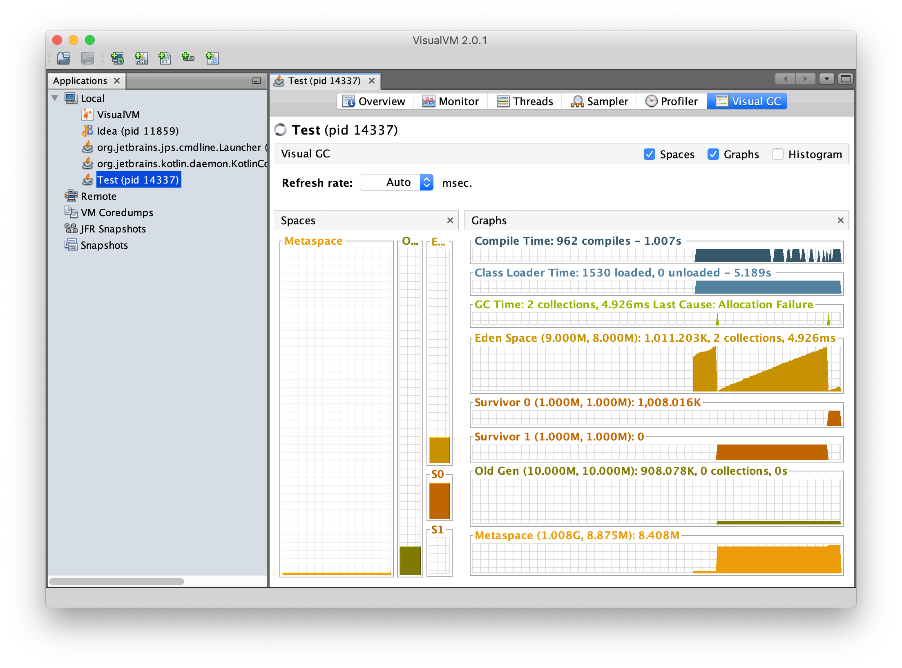

## JVM：垃圾回收机制

#### 哪里需要 GC

在 JVM 的五个内存区域中，程序计数器、虚拟机栈、本地方法栈 3 个区域随着线程创建而创建，随着线程的销毁而销毁，其中 JVM 规范中对程序计数器这个区域没有定义 OOM，而栈中栈帧随着方法的进入和退出有条不紊的执行这入栈和出栈操作，这几个区域是不用考虑垃圾回收的问题的。

而堆和方法区则不一样，我们只有在程序处于运行期间时才能知道会创建哪些对象，这部分内存的分配和回收都是动态的，垃圾收集器所关注的就是这部分内存。

#### 什么是垃圾

JVM 使用一种 ”可达性分析“ 的算法来决定对象是否可以被回收。

在可达性分析算法中，JVM 把内存中所有对象之间的引用关系看做一张图，以 GC Root 对象为起始点，从这些节点开始向下搜索，最后判断对象的引用与 GC Root 是否具有可达路径来决定对象是否可以被回收。




##### GC Root

一个对象如果不想被 GC 回收，它要么是 GC Root，要么与 GC Root 可达，常见的 GC Root 有以下几种：

1. Java 虚拟机栈中引用的对象
2. 方法区静态引用指向的对象
3. 处于存活的线程对象
4. Native 方法中 JNI 的引用对象

##### 什么时候触发回收

1. Allocation Failure：剩余堆内存不足导致对象内存分配失败时
2. 手动调用 System.gc() 时

#### 垃圾回收算法

##### 标记清除算法

Mack and Swap GC，标记清除算法分为两个步骤：

1. Mark 标记阶段：遍历内存，将 GC Root 以及与 GC Root 直接或者间接相连的对象标记为存活对象，否则标记为垃圾对象。
2. Swap 清除阶段：将标记为垃圾的对象直接清除。

优点：实现简单，不需要将对象进行移动

缺点：需要中断进程中其他组件的执行，并且可能产生内存碎片，使得垃圾回收的频率会提高。

##### 复制算法

1. 将内存分成两块，每次只使用其中的一块，在垃圾回收时，遍历当前使用的内存，并对其中的对象进行标记。
2. 标记完成之后，将所有可达对象复制到另一块内存，并将其设置为当前使用的内存，然后清除上一块内存中的所有对象。

优点：不会产生内存碎片

缺点：可用内存缩小为原来的一半，对象存活率高时会频繁复制内存（对象存活率高，可用内存少，然后需要频繁		    的 GC，频繁的复制内存），降低了性能。

##### 标记压缩算法

1. Mark 标记阶段：遍历内存，将 GC Root 以及与 GC Root 直接或者间接相连的对象标记为存活对象，否则标记为垃圾对象。
2. Compact 压缩阶段：将存活对象按照顺序移动到内存的一段，清除垃圾对象

优点：既避免了内存碎片的产生，又不需要将内存分成两个部分。

缺点：仍需要对对象进行移动，在一定程序上降低了效率。

#### JVM 分代回收策略

JVM 根据对象的存活周期不同，把内存划分为新生代、老年代，在 HotSpot 中除了新生代和老年代，还有永久代。

分代回收的策略就是：对于新创建的对象会在新生代中分配内存，此区域的对象生命周期一般较短，如果经过多次回收仍然存活下来，则将它们转移到老年代。

新生成的对象会优先存放在新生代中，新生代又可以细分为 3 个部分，Eden、Survivor1、Survivor2 三个部分，它们的内存大小比例为 8:1:1

对象被创建出来的时候，会放入 Eden 区，在 Eden 区满后，会进行垃圾回收，首先将 Eden 区的垃圾对象清除，并将存活对象复制到 S0，此时 S1 是空的。

下一次 Eden 区满后，再进行一次垃圾回收，此时会将 Eden 区和 S0 区的垃圾对象清除，并将存活对象复制到 S1，此时 Eden 和 S0 区都是空的。

如此在 S0 区和 S1 区切换几次后（默认 15 次），如果还有存活对象，说明这些对象的生命周期较长，将它们转移到老年代中。

对于 S0 和 S1，分配对象的区域被称为 from 去，复制到的区域被称为 to 区。

新生代中因为要进行一些复制操作，所以一般是否的 GC 算法是复制算法。

老年代的内存一般比新生代要大，内存默认是新生代的 2 倍，能够存放更多的对象，如果对象比较大（比如长字符串或者大数组），这个大对象在创建时会直接分配到老年代上。

我们可以使用 -XX:PretenureSizeThreshold 来控制直接升入老年代的对象的大小，大于这个值的对象会直接分配到老年代上。

老年代因为对象的生命周期较长，不需要过多的复制操作，一般采用标记压缩算法。

如果老年代引用了新生代的对象，那么在新生代 GC 的时候，需要查询整个老年代上可能存在的引用新生代的情况，这是非常低效的，所以老年代中维护了一个 512 byte 的 card table，所有老年代引用新生的对象信息都记录在这里，这样，每当新生代发送 GC 时，只需要检查这个 card table 就可以了。

#### 验证 JVM 分代回收

Minor GC：在 Eden 区没有足够的空间进行分配时，虚拟机将发起一次 Minor GC，因为大部分的 Java 对象的生命周期非常的短，所以 Minor GC 非常的频繁，回收速度也很快。

Major GC：发生在老年代的 GC 叫做 Major GC，当出现了 Major GC 至少伴随着一次 Minor GC。

> 为什么 Major GC 经常伴随着一次 Minor GC
>
> 这个是有具体由 GC 算法决定的，目前大部分 GC 都是这样的（也有不是的），具体的原因应该是 Major GC 的回收速度相比 Minor GC 慢十倍，进行一次 Minor GC 的主要目的是清理 Eden 空间，减少后续出现 Minjor GC 的频率。

Full GC：Full GC 代表着整个堆内存的回收，也就是新生代 + 老年代。

代码和虚拟机参数如下：

```java
/**
 * -Xms20M 堆的初始内存为 20M
 * -Xmx20M 堆的最大内存为 20
 * -Xmn10M 新生代内存大小为 10M,剩下的 10M 会自动分配给老年代
 * -XX:+PrintGCDetails 输出 GC 日志
 * -XX:SurvivorRatio=8 新生代 Eden:S0:S1 = 8:1:1
 */
public class Test {

    private static final int _1MB = 1024 * 1024;

    public static void main(String[] args) {
        byte[] a = new byte[_1MB * 2];
        byte[] b = new byte[_1MB * 2];
        byte[] c = new byte[_1MB * 2];
        byte[] d = new byte[_1MB * 2];
    }
}
```

编译完成后，使用 `java -Xms20M -Xmx20M -Xmn10M -XX:+PrintGCDetails -XX:SurvivorRatio=8 Test` 命令运行 class 文件。

日志如下：

```java
Heap
 PSYoungGen      total 9216K, used 2212K [0x00000007bf600000, 0x00000007c0000000, 0x00000007c0000000)
  eden space 8192K, 27% used [0x00000007bf600000,0x00000007bf8290e0,0x00000007bfe00000)
  from space 1024K, 0% used [0x00000007bfe00000,0x00000007bfe00000,0x00000007bff00000)
  to   space 1024K, 0% used [0x00000007bff00000,0x00000007bff00000,0x00000007c0000000)
 ParOldGen       total 10240K, used 6419K [0x00000007bec00000, 0x00000007bf600000, 0x00000007bf600000)
  object space 10240K, 62% used [0x00000007bec00000,0x00000007bf244c00,0x00000007bf600000)
 Metaspace       used 2618K, capacity 4486K, committed 4864K, reserved 1056768K
  class space    used 286K, capacity 386K, committed 512K, reserved 1048576K
```

上面的 a、b、c 在 Eden 去占用了 6MB 内存，在给 d 分配内存是，发现 Eden 区的剩余内存已经不够了，于是触发了一次 Minor GC，而虚拟机发现 3 个 2M 的对象无法保存在 Survivor 空间（S0 和 S1 的大小只有 1MB），之后将这三个对象转移到老年代，之后将 d 分配在 Eden 区。

经过这次 GC 后，Eden 占用 4MB 内存（d 对象），Survivor 区空闲，老年代占用 6MB 内存（a、b、c 三个对象）。

#### 总结：什么时候对象会进入到老年代？

1. 大对象，所谓的大对象，指需要大量连续内存的 Java 对象，常见的有长字符串或者大数组，虚拟机提供了一个 ` -XX:PretenureSizeThreshold` ，让大于这个值的对象直接分配在老年代上。
2. 长期存活对象，Java 对象在 Survivor 区每经历一次 GC，年龄会加 1，当其年龄增长到一定程序会进入老年代，默认值为 15，可以通过 -XX:MaxTenuringThreshold 参数设置，但是这个值在对象头中用 4bit 存储，最大值就是 15。
3. 同年对象达到 Survivor 空间一半时，为了能更好地适应不同程序的内存状况，虚拟机并不是永远地要求对象的年龄必须达到了 MaxTenuringThreshold 才能晋升老年代，如果在 Survivor 空间中相同年龄所有对象大小的总和大于 Survivor 空间的一半，年龄大于或等于该年龄的对象会直接进入老年代。
4. 在 Minor GC 发生后，Survivor 区无法容纳的对象会直接进入老年代，这里涉及一个老年代的空间分配担保。

#### 老年代的空间分配担保

发生 Minor GC 之前：

1. 虚拟机检测老年代最大可用连续空间是否大于新生代对象总空间，如果大于，Minor GC 绝对安全
2. 如果小于，虚拟机查看 HandlePromotionFailure 值，如果允许担保失败，检查老年代最大可用连续空间是否大于历次晋升到老年代对象的平均大小，如果大于，进行一次 Minor GC
3. 如果小于，或者 HandlePromotionFailure 设置不允许担保失败，进行一次 Full GC。

最后，一般情况下为了避免过多的 Full GC，都会把 HandlePromotionFailure 打开。

#### 为什么要尽量避免 Full GC 呢？


#### Stop The World & Safepoint & Safe Region

Java 中 Stop The World 机制简称 STW，在 GC 进行时，Java 应用程序的除垃圾收集线程外其他所有线程都会被挂起，所有的 Java 代码停止，native 代码可以执行，但不能与 Java 代码交互。

在进行 GC 之前要进行可达性分析，如果出现一边分析，一边对象的引用关系还在不断的变化的情况，可达性分析的结果的准确性就无法得到保证，这点是导致 GC 运行必须停顿所有 Java 线程的一个重要原因。

在系统停顿下来后，如果通过遍历所有的引用链来检测对象的可达性会让系统 stop 的时间变得很长，这是不现实的，在 HotSpot 中，采用一个 OopMap 来解决这个问题，在 JIT 编译过程中，HotSpot 会在特定的位置使用 OopMap 记录下引用信息。

这些特定的位置被成为安全点（Safepoint），程序并非在任何地方都能停顿下来进行 GC，只有所有线程都到达安全点（Safepoint）时才能暂停。在安全点的位置所有GC Root 的状态都是已知。

安全点的选取既不能太少，这样 GC 的等待时间会很长，但是因为在每个安全点都需要用 OopMap 来记录引用信息，太多的话，会增加虚拟机运行时的负荷。

安全点一般会选取在经常复用的指令上面，例如：方法调用、循环跳转、异常跳转等。

线程在安全点是如何中断的呢？虚拟机在安全点的位置会设置一个中断标志，当线程到达安全点是，会检查这个标志，如果发现标志位真，就自己中断挂起。

还有一个问题，如果线程处于 Sleep 状态或者 Blocked 状态，是没有办法进入安全点的，对于这种情况需要安全区域来解决。安全区域（Safe Region）是指在一段代码片段之中，引用关系不会发生变化，在这个区域内进行 GC 都是安全的，当线程进行安全区域后，会将自己标识为 Safe Region 的线程，当虚拟机 GC 时就可以不用管这个线程，当这个线程离开安全区域的时候，会检查 GC 是否已经完成，如果完成了，就继续执行，如果没有完成，就要等待，直到收到 GC 完成的信号。

#### VisualVM

VisualVM 这个工具，安装  Visual GC 插件，使用这个工具能非常直观的看到堆中内存的变化，例如下图：



