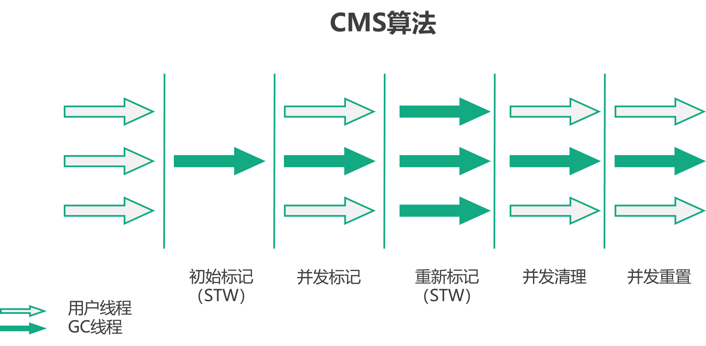
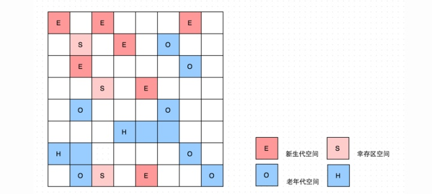

## JVM：常见的垃圾收集器

如果说分代回收是内存回收的策略，收集算法是内存回收的方法论，那么垃圾收集器就是内存回收的具体实现。

#### Serial 

最基本、最悠久的垃圾收集器，单线程收集器，采用复制算法，STW 时间会长一些，Serial 没有线程交互的开销，在单线程环境下简单而高效。

#### ParNew 

Serial 收集器的多线程版本，默认的收集线程数目与 CPU 数目相同，可以使用 -XX:ParallelGCThreads 参数来限制垃圾收集的线程数，也是采用复制算法，常常作为新生代收集器，与 CMS 收集器（老年代收集器）配合使用。

#### Parallel Scavenge

Parallel Scavenge 也是一个用于新生代的多线程收集器，同样采用复制算法，与 ParNew 相比，Parallel Scavenge 更关心 CPU 的吞吐量，Parallel Scavenge 收集器提供了两个参数用于精确控制吞吐量：

- -XX:MaxGCPauseMillis，控制最大垃圾收集停顿时间，但是 GC 的停顿时间，是通过牺牲吞吐量和新生代空间换来的，把新生代空间设置的小一些，垃圾回收的速度自然就快了（回收 500M 的内存肯定比回收 300M 的内存快），但是会造成垃圾收集更加频繁，吞吐量下降。
- -XX:GCTimeRatio: 可以直接设置吞吐量大小

高吞吐量意味着 CPU 的高效利用，提顿时间越短，与用户的交互越流畅，Parallel Scavenge 比较适合在后台运算而不需要处理过多的交互任务的场景。

此外，Parallel Scavenge 还提供了一个 -XX:+UseAdaptiveSizePolicy 开关，将开关打开后，Parallel Scavenge 将根据当前系统运行的情况自动调整参数已提供最合适的停顿时间和吞吐量，这种调节方式成为 GC 自适应调节策略。

#### Serial Old

Serial 收集器的老年代版本，采用单线程和标记整理算法。

#### Parallel Old

Parallel Scavenge  收集器的老年代版本，采用多线程和标记整理算法。

在 Parallel Old 出现之前，如果在新生代选择了 Parallel Scavenge 那么老年代只能使用 Serial Old（Parallel Scavenge  不能和 CMS 配合使用），这样由于 Serial Old 的性能不高，无法发挥出 Parallel Scavenge 的吞吐量优势。

在 Parallel Old 出现后，在注重吞吐量和 CPU 敏感的场合，可以优先考虑 Parallel Scavenge  + Parallel Old 了。

#### CMS

CMS 的全称是 Concurrent Mark Sweep，它是一款以获取最短停顿时间为目标的垃圾收集器，CMS 是 JDK1.7 之前最主流的回收器，它基于标记清除算法。

它的运行分为 4 个步骤：

1. CMS initial mark，初始标记，标记 GC Root 直接关联的对象，速度很快。
2. CMS concurrent mark，并发标记，GC 线程和应用线程并发执行，在初始标记的基础上向下追溯，标记其他可达对象。
3. CMS remark，重新标记，修正并发标记阶段，因为应用线程的运行而导致标记产生变动的部分。
4. CMS concurrent swap，并发清除，GC 线程和应用线程并发执行，清除垃圾。
5. CMS reset，并发重置，为下一次 GC 重置相关的数据结构。

CMS 最大的有点就是 stop the world 时间短，但不是没有，初始标记、重新标记这两个步骤仍然需要 stop the world。

#### CMS 的缺点

##### CPU 敏感

CMS 收集器对 CPU 资源非常敏感，在并发阶段，它虽然不会导致用户线程停顿，但是因为占用了一部分 CPU 资源，会导致应用变慢，CMS 默认的回收线程是 4/ ( CPU 数量 + 3)，CPU 数目越多，垃圾收集线程占用的 CPU 资源越少。在 CPU 数量为 5 为，垃圾收集线程会占用 25% 的 CPU，在 CPU 数目为 1 时，垃圾收集线程会占用所有 CPU 资源，这个时候从并发回收变成了单线程回收。

##### 无法处理浮动垃圾

CMS 无法处理浮动垃圾，由于 CMS 在完从标记后进行并发清理的时候，还有用户线程在不断运行，不断有新的垃圾产生，对于这部分垃圾 CMS 只能在下一次 GC 的时候清理它们。而且 CMS 在并发收集的时候，必须留有一部分内存空间给用户线程使用，如果这部分内存无法满足程序要求，就会出现 Concurrent Mode Failure 这个错误。这是虚拟机将使用 Serial Old 来进行老年代垃圾的收集。

##### 内存碎片

CMS 的最后一个缺点是它采用标记清除算法来进行老年代垃圾的清理，会产生很多内存碎片，在无法找到足够大的连续空间来分配当前的对象时，会触发一次 Full GC。CMS 为了解决这个问题在内存顶不住进行 Full GC 之前会进行一次内存整理，这个整个过程没有办法并发，会触发短暂的 stop the world。此外还可以设置在进行多少次 Full GC 进行一次内存整理，默认值为 0，就是每次 Full GC 都会进行内存整理。

#### G1

> 关于 G1 可以看看 R 大的这个帖子：https://hllvm-group.iteye.com/group/topic/44381
>
> 还有美团的这篇文章：https://tech.meituan.com/2016/09/23/g1.html

G1 是 JDK1.9 后 JVM 的默认垃圾回收算法，G1 取消了堆中新生代和老年代的物理划分，但是它仍然是分代回收的。G1 将堆划分为若干个区域，称作 Region（1~32M），Region 有四种类型，分别是 E、S、O、H，分别表示Eden、Survivor、Old、Humongous。

Humongous 表示大对象，当分配的对象大于等于 Region 的一半是，就会被认为是大对象，大对象会默认分配在老年代，这个可以防止 GC 时对大对象的拷贝。

##### RSet

G1 通过 Remembered Set 来记录不同 Region 之间的引用，以及年轻代和老年代之间的引用，以避免在垃圾回收的时候进行全堆扫描。

每一个 Region 都有一个与之对应的 Remembered Set，虚拟机在对引用数据类型进行写操作时，会产生一个 Write Barrier 来中断写操作，检测对象是否在不同的 Region 之中，如果是会将相关引用的信息记录到被引用对象所属的 Remembered Set 中，在标记可达对象的时候，就可以通过查看 Remembered Set 来避免用全堆扫描的方式检测对象是否在不同的 Region 之间有引用。

##### G1 的两种模式

Young GC：

当 Eden 区不能分配新的对象的时候就会触发 Yong GC，此时 G1 选定所有的 Eden/Survivor Region，将其对应 RSet 中记录的对象作为根集扫描获取存活对象，将 Eden/Survivor 区的存活对象拷贝合并到新的 Survivor 中，当 Survivor 区空间不够时，Eden 区的对象会直接晋升到 Old 区；如果 Survivor 区的对象达到一定年龄，也会晋升到 Old 区。

这个过程是多线程并发执行的，会触发 STW，Yong GC 会通过控制年轻代的 Region 个数来来控制开销。

Mixed GC：

Mixed GC 翻译过来叫做混合回收，会回收所有年轻代的 Region 以及全局并发标记统计出来的部分收益较高的老年代 Region。

Mixed GC 通过控制选择多少、哪些 Old Region 来控制开销。

G1 是不提供 Full GC 的，如果 Mixed GC 实在无法跟上程序分配内存的速度，导致老年代填满无法继续进行 Mixed GC，就会使用 Serial Old GC（Full GC）来收集整个GC heap。

G1 的正常工作流程会不断在 Young GC 和 Mixed GC 之间切换，后台定期做全局并发标记，在。

**Mixed GC 的工作步骤如下：**

1. 全局并发标记：

   - 初始标记，STW，标记从 GC Root 开始直接可达的对象
   - 并发标记，从 GC Root 开始对堆中其他的对象进行可达性分析，标记存活对象，并收集 Region 存活对象的信息，这个过程会通过 三色标记法和 STAB 保证标记对象的准确性。
   - 最终标记，STW，修正那些在并发标记阶段发生变化的对象。
   - 清理阶段：STW，重置标记状态，清空没有存活对象的 Region，放入可分配 Region 列表中。

2. 拷贝存活对象：

   STW，会根据各个 Region 中的回收价值和成本（根据回收所得空间大小和所需时间进行综合判断），在限定的时间内，优先对价值大 Region 进行回收，即 Garbage First，这也是 G1 名称的由来。

   这个时候 G1 会选择一个或多个 Region 中的存活对象构成 CSet（Collection Set），在选定 CSet 后，拷贝并合并到新的空 Region 中，copy 的过程实现了压缩，减少内存碎片化。

##### G1 的优点

不会产生内存碎片：G1 在回收的时候回找到一个或多个 Region 中的存活对象，拷贝并合并到新的空 Region 中，copy 的过程实现了压缩，减少内存碎片化。

回收效率高：G1 在进行垃圾回收时会优先回收价值大的 Region，保证了 G1 在有限的时间内可以获得更好的回收效率。

停顿时间短：G1 的 STW 时间是可以设置的，G1 采用每次只清理一部分而不是全部 Region 的方式清理，由此保证每次 GC 的停顿时间不会过长。

##### 三色标记法

三色标记法是 GC 中用于标记可达对象的一种算法，它最大的好处就是可以并发标记，G1 和 CMS 都是使用的三色标记法进行标记的。

三色标记法，把 GC 中的对象划分为三种情况：

黑色：对象被标记了，且它的所有的引用也被标记完了

灰色：对象被标记了，但是它的引用还没有被标记或标记完。

白色：对象没有被标记到，标记阶段结束后，会被当做垃圾回收掉。

在三色标记中，黑色和白色之间是不相连的，三色标记法步骤如下：

1. 创建三个集合：白、灰、黑
2. 将所有对象放入白色集合
3. 从 GC Root 开始遍历所有对象，遍历到的对象从白色集合放入灰色集合
4. 遍历灰色集合，将灰色对象引用的对象放入灰色集合，将该对象放入黑色集合
5. 通过 Write Barrier 来检测对象的变化
6. 收集所有白色对象（垃圾）

##### STAB

> https://juejin.im/post/5e5283abf265da573d61a311

Snapshot at the beginning，SATB 是维持 GC 并发准确性的一个手段，主要解决的问题就是并发标记过程出现的问题：

- 将垃圾对象标记为了存活对象，这个会造成浮动垃圾，但是问题不大。
- 将存活对象标记成了垃圾对象，这个就严重了。

将对象标记为垃圾必须满足下面两个条件：

- 一个黑色对象的引用类型字段被赋值了白色对象
- 所有灰色对象到这个白色对的引用都被删除

对于这个问题，CMS 采用的是 Incremental Update，G1 采用的是 STAB。

Incremental Update 在黑色引用被赋值白色引用的时候，会记录这个黑色引用，之后重新扫描一次。

STAB 是如何保证并发准确性的：

1. STAB 会在标记开始的时候生成一个快照图，标记存活对象，在并发标记的过程中不会将快照中的存活对象当作垃圾处理；

   > 网上都这样写，但是完全不知道这个快照有什么用  ？？？

2. 对于 new 出来的对象，SATB 也会隐式的标记为存活的对象；

3. 在并发标记的时候通过 Write Barrier 记录引用改变的对象，并将其置为灰色，之后重新扫描一次。

#### ZGC

ZGC 旨在为大堆提供非常低的暂停时间，能够支持 TB 级别的堆，做到 10ms 以下的停顿时间。

它通过使用动态 Region ( 动态创建和销毁、动态决定大小 )、着色指针、读屏障等技术来实现这一点。

ZGC 最大的特点就是几乎全程都在并发执行，与标记对象的传统算法相比，ZGC 在指针上做标记，在访问指针时加入 Load Barrier（读屏障），比如当对象正被 GC 移动，指针上的颜色就会不对，这个屏障就会先把指针更新为有效地址再返回，也就是，永远只有单个对象读取时有概率被减速，而不存在为了保持应用与 GC 一致而粗暴整体的 Stop The World。                