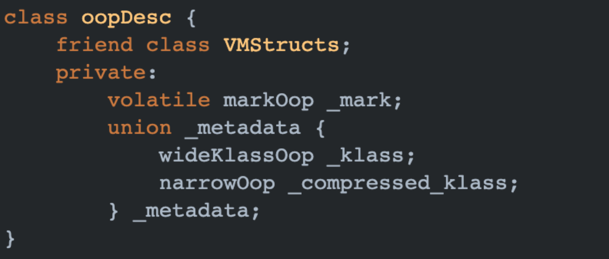
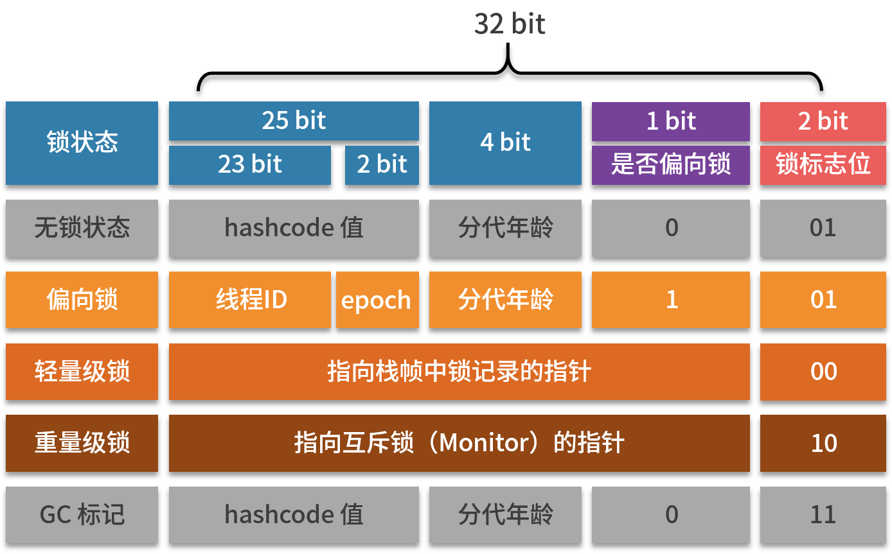
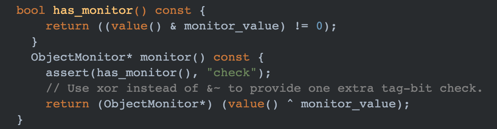

## Java 并发：synchronized 实现原理

#### 对象头

JVM 本身是由 C++ 代码实现的，它设计了一个 OOP-Klass Model 来映射 Java 的对象。

其中 OOP 表示 Ordinary Object Pointer，普通对象指针，用来表示对象的实例信息，Klass 包含元数据和方法信息 用来描述 Java 类。

Klass 用来表示 class 的元数据，其中包括常量池、字段、方法、类名、父类等，JVM 在加载字节码文件的时候，会在方法去创建一个 Klass 类型的 instanceKlass 对象，instanceKlass 可以看做 VM 级别的 Class，在 JVM 完成 class 对象解析的时候，将常量池中的符号引用转换直接引用，并赋值给 instanceKlass 中的变量。

OOP 用来表示对象的实例信息，Java 使用 new 关键字创建对象的时候，会在堆中创建一个 instanceOopDesc 对象，用来存储对象头和实例数据，它的积累是 oopDesc，其结构如下：

Java 对象在内存中分为对象头、实例数据、对齐填充，其中 _mark 和 _metadata 一起组成了对象头，其中 _metadata 用来保存类的元数据，\_mark 属性，一般称他为标记字段 Mark Word，其中主要存储了对象的 identityHashcode、分代年龄、锁标志位、是否是偏向锁等。

在 32 位的虚拟机中，Mark Word 结构如下：

#### Monitor

在 Java 6 之前，synchronized 底层通过操作系统的 Mutex lock 实现，这需要一个从操作系统用户态到内核态的转变，是一个非常重的操作，所以被成为重量级锁，当锁为重量级锁的时候，Mark Word 会用 30 位指向 Montior。

Montior 实际上是保存在 Mark Word 中的一个对象，在 _markOop 中有如下代码：

monitor() 方法会创建一个 ObjectMonitor 对象，ObjectMonitor 是 Montior 的具体实现，Java 中每一个对象都对应一个 ObjectMonitor，因此，每个对象都可以作为锁。

在 ObjectMonitor 中有几个比较重要的属性：

当多个线程访问 synchronized 同步代码时，首先会进入 _EntryList 队列，当某个线程获取锁后，\_owner 会指向z这个线程，同时 \_count 计数器加 1。

如果获取到锁的线程调用 wait 方法后，\_owner 会指向 null，_count 计数器会减 1，同时该线程进入 _WaitSet 队列中等待被唤醒。

当线程执行结束之后，同样会 \_owner 指针，_count 计数器减 1，以便其他线程可以继续获取锁。

####synchronized 锁升级的过程

1. 对象刚 new 出来的时候，处于无锁的状态。

2. 当一个线程获取锁之后，升级为偏向锁。

   偏向锁的意思是当一个获取了一个偏向锁，如果在接下来的一段时间，没有其他线程来竞争锁，那么持有偏向锁的线程再次进入或者退出一个同步代码块，不需要再进行获取锁和释放锁的操作。

   偏向锁的具体实现是通过对象头中的 ThreadId 来做的，默认情况下这个字段是空的，当线程第一次获取锁的时候，会使用 CAS 的方式将自身的 ThreadId 写入对象头中的 ThreadId 中，同时将偏向锁标志设置为 1，将锁标志设置为 01。

   在下次线程获取锁时，会检查 ThreadId 是否为空，如果为空，进行 CAS 操作，CAS 失败的话，说明存在锁的竞争，偏向锁会升级为轻量级锁。

   如果不为空，比较 ThreadId 是否锁对象头中的 ThreadId 一致，如果一致，认为当前线程已经获取了锁，不再进行加锁操作。如果不一致，说明存在锁的竞争，偏向锁会升级为轻量级锁。

   > 偏向锁的目的是为了提高锁总是被一个线程获取的情况下的效率。

3. 当出现多个线程竞争锁时，对象头中的所标志会设置为 00，偏向锁会升级为轻量级锁。

   线程在执行同步代码时，JVM 会在当前线程的栈帧开辟一块空间 Lock Record，用于存储锁的记录，之后会使用 CAS 的方式，将对象头拷贝到这块空间中，并将 Lock Record 中的 owner 指针指向对象头。

   当线程再次执行这部分同步代码的时候，会当前线程的 owner 指针是否指向对象头，如果是则表示当前线程已经获取锁，直接执行同步代码，否则的话，使用 CAS 修改，如果 CAS 失败，会进行锁的自旋，如果仍然没有获取到锁，轻量级锁会升级为重量级锁。

   > 轻量级锁是为了提高线程交替执行同步代码效率，如果在同一时间有多个线程访问同一个锁，轻量级锁会升级为重量级锁。
   >
   > 所谓锁自旋，就通过循环的方式等待一段时间，看当前持有锁的线程是否会立刻释放锁。自选的缺点也很明显，因为自选这个操作会占用 CPU，如果持有锁的线程运行的时间比较长，自选锁通常不会获得锁，白白浪费了 CPU 的时间。在锁持有时间较长，锁竞争激烈的情况下，应该主动禁用自选锁。

偏向锁与轻量级锁 CAS 的区别：

偏向锁只有在 ThreadId 为空才会进行 CAS 操作，CAS 失败后直接升级为轻量级锁。

轻量级锁在获取锁的时候就会进行 CAS 操作，CAS 失败后还会进行一个短暂的自旋，在自旋失败后才会升级为重量级锁。

#### Thanks

https://www.yuque.com/yinjianwei/vyrvkf/og00ra

https://mp.weixin.qq.com/s/WWRbfmY2vVy-usVXgaIdAA