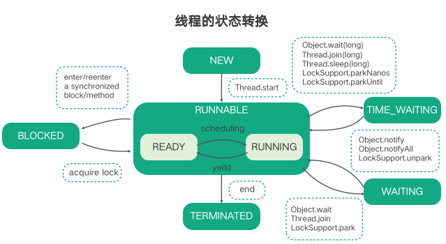

## Java 并发：线程的状态

#### 概述

在 Java 中线程一共有 6 中状态，对应 Thread.State 中的枚举常量：

- NEW：初始化状态
- RUNNABLE：可运行/运行状态
- BLOCKED：阻塞状态
- WAITING：无限时等待状态
- TIMED_WAITING：有限时等待状态
- TERMINATED：终止状态

#### 线程之间的状态转换

1. 线程刚创建出来后处于 NEW 状态

2. 调用线程的 start 线程进入 RUNNABLE 可运行状态，此时线程并不会立刻运行，会先进入 READY 状态等待 CPU 调度，获取 CPU 后进入 RUNNING 运行状态。

3. 当线程遇到 synchronized 的话，会尝试会去锁，获取锁失败会进入 BLOCKED 状态，获取锁成功后，重新进入 RUNNABLE 状态。

   注意，当线程在 RUNNABLE 状态调用一些阻塞 API 是，并不会改变线程的状态，在 JVM 看来，线程等待 CPU 和等待 I/O 等没有区别，都是等待某个资源。

4. 线程调用 wait 方法、获取遇到其他线程的 join 方法时、调用 LockSupport.pack 方法，都会进入 WAITING  状态

   调用对应的，notify ( notifyAll )、LockSupport.pack 线程会重 WAITING 进入 RUNNABLE 状态

5. 线程调用下面几种方法会从 RUNNABLE 进入 TIMED_WAITING 状态

   - wait(long)
   - join(long)
   - sleep(long)
   - LockSupport.parkNanos
   - LockSupport.parkUntil

   对应的调用 notify ( notifyAll )、LockSupport.pack 线程会重 TIMED_WAITING 重新进入 RUNNABLE 状态

6. 线程的 run 方法运行结束后，进入 TERMINATED 状态。

#### 如何结束一个线程

1. 等待 run 方法运行结束
2. 在 run 方法运行的时候加一个标志，手动修改标志使 run 方法运行结束
3. 对于处于 WAITING 和 TIMED_WAITING 的线程，调用其 interrupt 方法，这是线程会重新回到 RUNNABLE 状态。